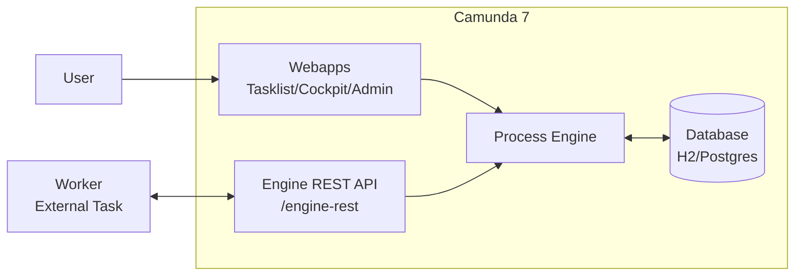

# 00 - Core concepts (Camunda 7)

This chapter maps Camunda 7 terms to what you will actually do.

## Minimal mental model

- You model a **process definition** with BPMN
- You deploy the definition to the **process engine**
- Starting it creates a **process instance**
- When the instance reaches a **user task**, a task appears in Tasklist
- For automation steps, you typically use:
  - Java Delegate / Spring (embedded in your app)
  - or External Task + Worker (outside the engine)

## Components and relationships

## BPMN: process definition

- **Process definition**: the BPMN model you deploy
- **Process key**: stable identifier (e.g. `hello-user-task`)
- **Version**: each deployment creates a new version for the same key

## Process instance

- Created when you start a process definition
- Each instance has its own variables and execution state

## Tasks

### User Task

- Work performed by humans
- Shows up in Tasklist

### Service Task / External Task

- Work performed by code
- **External Task** is a common integration pattern in Camunda 7:
  - Engine manages the “what”
  - Workers fetch/lock jobs via REST and complete them

## Variables

- Runtime data for an instance
- Practical tips:
  - prefer simple types (string/number/boolean)
  - serialized complex objects can cause compatibility/debug issues

## Errors and incidents

- **BPMN Error**: expected error you model and handle (boundary event)
- **Incident**: execution failure not handled (visible in Cockpit)

## Checklist

- You can explain definition vs instance
- You know Tasklist is for user tasks
- You know External Tasks are executed by external workers
