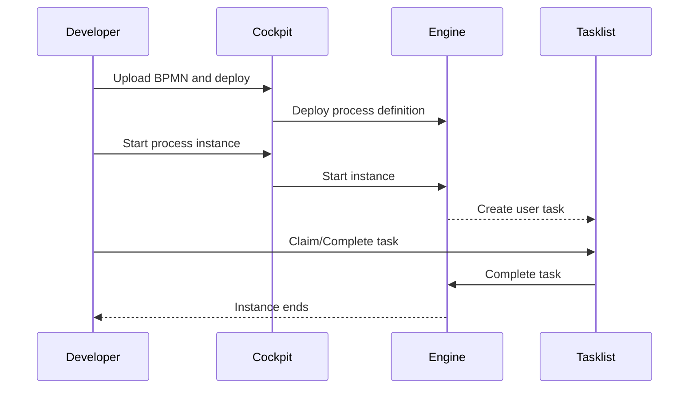

# 02 - Build & deploy your first process (Hello User Task)

Goal: deploy a minimal BPMN, start an instance, and complete a user task in Tasklist.

We will use the sample process:

- [camunda/examples/hello-user-task.bpmn](../../examples/hello-user-task.bpmn)

## 1) Deploy (via Cockpit)

1. Open Cockpit:
   - http://localhost:8090/camunda/app/cockpit/default/
2. Go to Deployments (UI may vary by version)
3. Upload `hello-user-task.bpmn` and deploy

You should see a process definition with key `hello-user-task`.

## 2) Start an instance

In Cockpit, open the definition and click **Start instance**.

Optional REST start:

```bash
curl -s -X POST \
  'http://localhost:8090/engine-rest/process-definition/key/hello-user-task/start' \
  -H 'Content-Type: application/json' \
  -d '{}' | jq .
```

## 3) Complete the user task in Tasklist

1. Open Tasklist:
   - http://localhost:8090/camunda/app/tasklist/default/
2. Find the task “Approve”
3. Claim and complete it

After completion, the instance reaches the end event.

## Diagram: what you just did



## Checklist

- You can see the definition in Cockpit
- You can start an instance
- You can complete the task in Tasklist
