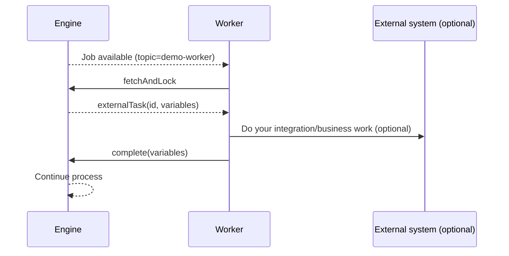

# 04 - External Task pattern (and workers)

Goal: understand External Tasks and run automation via an out-of-engine worker.

External Tasks are a common Camunda 7 integration pattern. In Camunda 8, the equivalent concept is a Job Worker.

## What is an External Task?

When a Service Task is configured with `camunda:type="external"`:

- the engine creates a job that can be fetched
- a worker calls `fetchAndLock` via Engine REST API
- the worker completes it via `complete` (or reports `handleFailure` / `handleBpmnError`)

## Samples used in this chapter

- BPMN:
  - [camunda/examples/external-task-demo.bpmn](../../examples/external-task-demo.bpmn)
- Minimal Worker (Node.js):
  - [camunda/examples/external-task-worker-node/worker.mjs](../../examples/external-task-worker-node/worker.mjs)

Topic in BPMN:

- `demo-worker`

## 1) Deploy the process

Deploy `external-task-demo.bpmn` via Cockpit (same as Chapter 02).

## 2) Start an instance

Start via Cockpit, or REST:

```bash
curl -s -X POST \
  'http://localhost:8090/engine-rest/process-definition/key/external-task-demo/start' \
  -H 'Content-Type: application/json' \
  -d '{"variables":{"demoInput":{"value":"hello","type":"String"}}}' | jq .
```

The process will wait at the External Task until a worker fetches it.

## 3) Run the worker

With Node.js 18+:

```bash
cd camunda/examples/external-task-worker-node
node worker.mjs
```

The worker keeps polling:

- `POST /engine-rest/external-task/fetchAndLock`
- `POST /engine-rest/external-task/{id}/complete`

## Diagram: External Task data flow



## Failures and retries (concept)

Two common categories:

- retryable (network/outage): use `handleFailure` with retries/backoff
- business errors: use `handleBpmnError` (and model boundary error events)

Chapter 05 ties this to incidents.

## Checklist

- You can explain why workers execute External Tasks
- You can deploy and start the process
- You can run a worker and see the process complete
