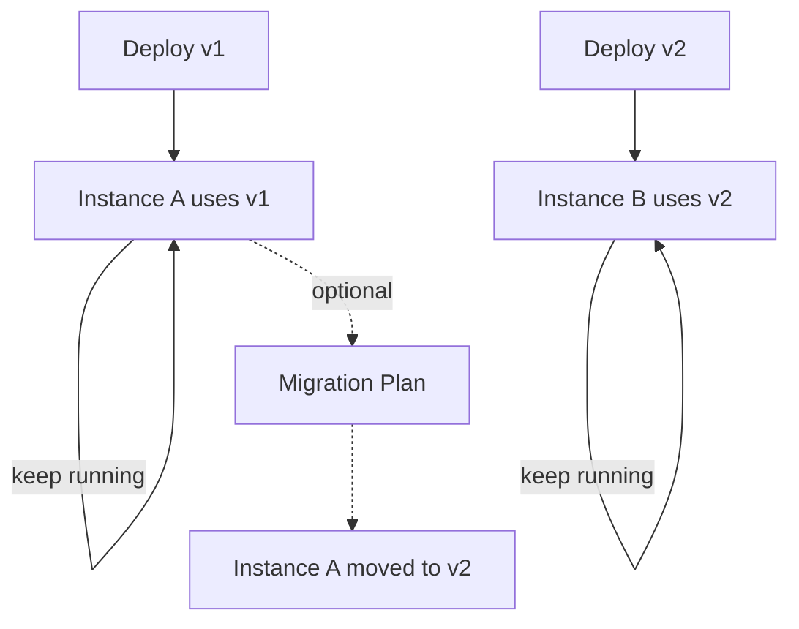

# 06 - Versioning and migration mindset

## Goal

Understand how versions are created and how to evolve processes without breaking in-flight instances.

## 1) How versions happen

For the same process key (e.g. `hello-user-task`):

- each deployment creates a new version
- new instances usually start on the latest version
- in-flight instances keep running on the old version

## 2) Why upgrades are hard

Because an in-flight instance might be:

- waiting at a user task
- waiting for external work
- on a particular branch/path

If you change the BPMN structure, old instances may not naturally align.

## 3) Migration basics

Camunda 7 supports migration (moving a running instance from v1 to v2).

You typically need:

- a migration plan (map old activities to new activities)
- a review of which changes are safe/automatic

## 4) Practical tips (learning)

- deploy small changes to build confidence
- design for compatibility:
  - avoid removing currently-used activities
  - adding activities is usually safer than reordering/removing

## Diagram: versions and instances

## Checklist

- You know versions are created by deployments
- You know in-flight instances don’t auto-switch
- You know migration requires explicit planning

## Next

Continue to [07 - Debugging & operations (Cockpit/logs/incidents)](07-debugging-and-ops.md).
