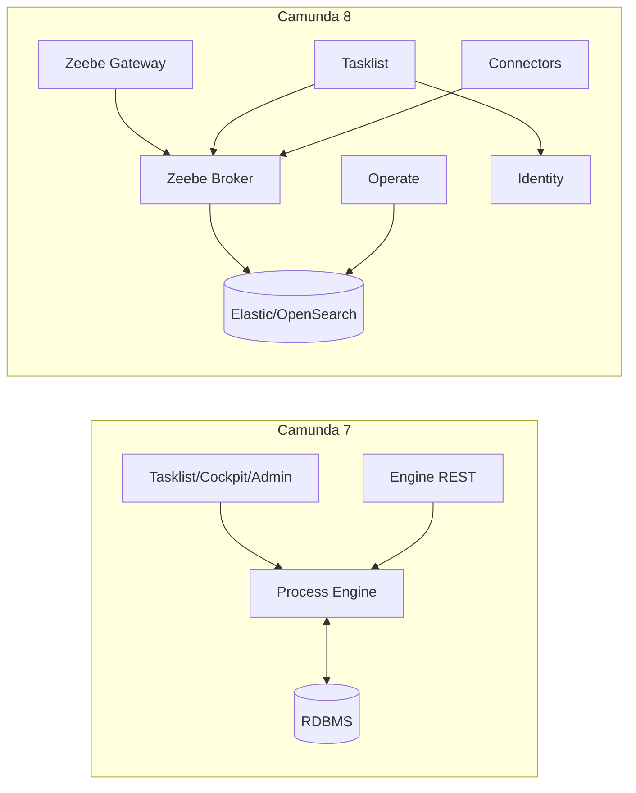

# 08 - Camunda 8 vs Camunda 7 (architecture/execution model)

Goal: once you understand Camunda 7, learn Camunda 8 differences quickly and avoid carrying over the wrong assumptions.

## One-sentence difference

- Camunda 7: “process engine + relational database” as the core (webapps operate the engine)
- Camunda 8: “Zeebe distributed workflow engine (broker)” as the core (jobs-driven, components separated)

## Architecture comparison (conceptual)

## Execution model differences

### Camunda 7

- The engine executes BPMN
- Service Tasks often use:
  - Java Delegates (inside engine)
  - External Tasks (outside engine)

### Camunda 8

- BPMN is still the primary modeling language (plus DMN, etc.)
- Automation is primarily done by **Job Workers** (external workers)
- More “work/jobs-driven” as a core concept

## Common mappings (intuition)

- Camunda 7 External Task ≈ Camunda 8 Job Worker (similar concept)
- Camunda 7 Cockpit ≈ Camunda 8 Operate
- Camunda 7 Tasklist ≈ Camunda 8 Tasklist (but different backend)

## What to watch out for

- Don’t expect Camunda 8 to behave like “one engine + one DB”
- Observability/search/operations usually depend on additional components (Operate + Elastic/OpenSearch)
- More components means:
  - higher deployment complexity
  - better scalability for high throughput

## Checklist

- You know Zeebe is the core of Camunda 8
- You know Camunda 8 automation is mainly Job Workers
- You know Operate/Tasklist/Connectors are split components
