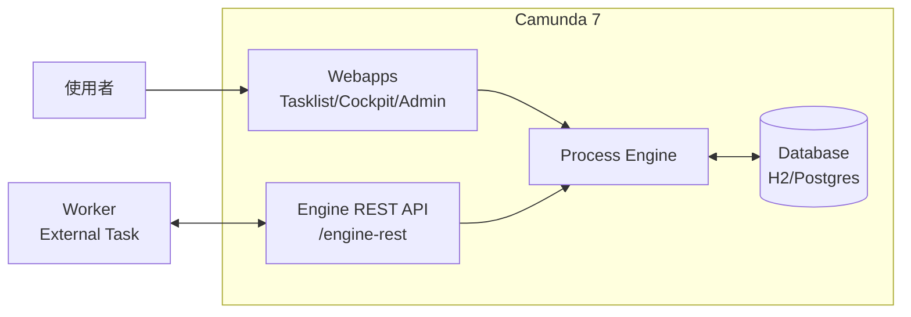

# 00 - 核心概念（Camunda 7）

## 目標

把 Camunda 7 的主要名詞與你實際會做的事對起來。

## 你在學什麼（最小心智模型）

- 你用 BPMN **建立**「流程定義」
- 把流程定義部署到流程引擎（Process Engine）
- 啟動流程後會產生「流程實例」
- 流程走到 user task 時，會在 Tasklist 出現任務讓人處理
- 流程走到自動化步驟時，你會用：
  - Java Delegate / Spring（內嵌於應用）
  - 或 External Task + Worker（引擎外部）

## 元件與關係

## BPMN：流程定義

- **流程定義（Process Definition）**：你部署上去的 BPMN 模型
- **流程 Key**：流程的穩定識別（例如 `hello-user-task`）
- **版本（Version）**：同一個 key 每次部署會產生新版本

## 流程實例（Process Instance）

- 你「啟動」流程定義後，會產生實例
- 每個實例都有自己的變數（Variables）與執行狀態

## 任務（Task）

### User Task

- 給人做的工作
- 常見：審核、補資料、決策
- 會出現在 Tasklist

### Service Task / External Task

- 給程式做的工作
- **External Task** 是 Camunda 7 常用的整合模式：
  - 引擎保留「要做什麼」
  - Worker 透過 REST 來抓工作並回報完成

## 變數（Variables）

- 流程運行時的資料
- 實務要注意：
  - 盡量用簡單型別（string/number/boolean）
  - 複雜物件序列化會影響相容性與除錯

## 錯誤與事故（Incidents）

- **BPMN Error**：你在模型裡預期會發生的錯誤（可被 boundary event 捕捉）
- **Incident**：引擎執行失敗且未被處理（常見在 Cockpit 看到）

## 檢核點

- 你能分清楚「流程定義」與「流程實例」
- 你知道 Tasklist 用來處理 user task
- 你知道 External Task 是引擎外部的 Worker 來做自動化

## 下一步

繼續到 [01 - Docker 快速開始（Camunda 7 Run）](01-quickstart-docker.md)。
