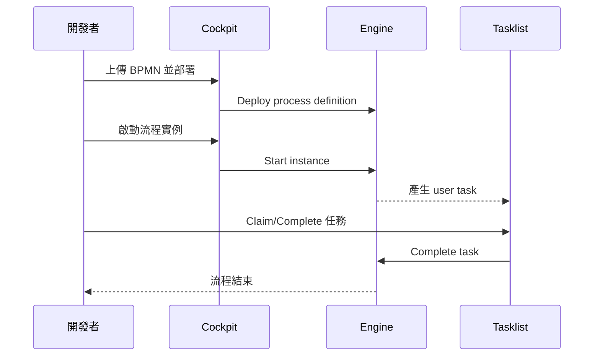

# 02 - 建立並部署第一個流程（Hello User Task）

## 目標

部署一個最小 BPMN，啟動流程實例，並在 Tasklist 完成任務。

我們會使用範例流程：

- [camunda/examples/hello-user-task.bpmn](../../examples/hello-user-task.bpmn)

## 1) 部署流程（用 Cockpit）

1. 開啟 Cockpit：
   - http://localhost:8090/camunda/app/cockpit/default/
2. 左側選單找到 **Deployments**（或右上角/部署按鈕，依版本 UI 可能略不同）
3. 上傳 `hello-user-task.bpmn` 並部署

部署成功後，你應該能在 Cockpit 看到流程定義 `hello-user-task`。

## 2) 啟動流程實例

在 Cockpit 中找到該流程定義，選 **Start instance**。

（選用：也可以用 REST 來啟動）

```bash
curl -s -X POST \
  'http://localhost:8090/engine-rest/process-definition/key/hello-user-task/start' \
  -H 'Content-Type: application/json' \
  -d '{}' | jq .
```

## 3) 在 Tasklist 完成 user task

1. 開啟 Tasklist：
   - http://localhost:8090/camunda/app/tasklist/default/
2. 你會看到一個任務（名稱：Approve）
3. Claim / Complete 任務

完成後，流程會走到 End event，該實例結束。

## 流程圖（你剛做了什麼）



## 檢核點

- 你能在 Cockpit 看到流程定義
- 你能啟動流程實例
- 你能在 Tasklist 找到並完成任務

## 下一步

繼續到 [03 - Tasklist 與表單/任務指派](03-tasklist-and-forms.md)。
