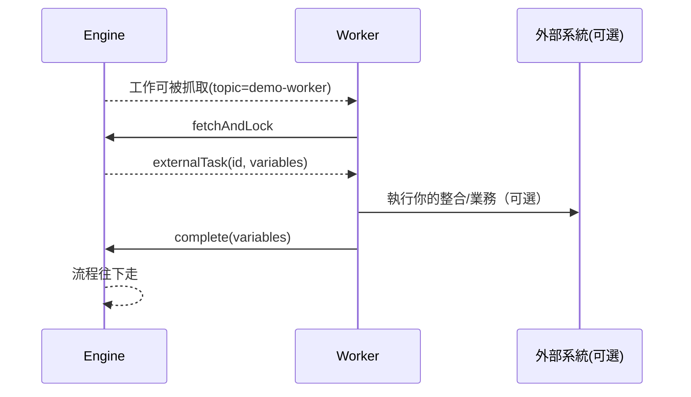

# 04 - External Task 模式（與 Worker）

## 目標

理解 External Task 的運作方式，並把流程中的自動化步驟交給引擎外部的 Worker。

> External Task 是 Camunda 7 常見整合方式；到 Camunda 8 會用「Job Worker」取代（概念相近但架構不同）。

## 什麼是 External Task

當 BPMN 的 Service Task 設定為 `camunda:type="external"` 時：

- 流程引擎會把該步驟變成一個「可被抓取的工作」
- Worker 透過 Engine REST API 呼叫 `fetchAndLock` 把工作鎖住
- Worker 做完事後呼叫 `complete`（或 `handleFailure` / `handleBpmnError`）

## 你要用的範例

- BPMN：
  - [camunda/examples/external-task-demo.bpmn](../../examples/external-task-demo.bpmn)
- 最小 Worker（Node.js）：
  - [camunda/examples/external-task-worker-node/worker.mjs](../../examples/external-task-worker-node/worker.mjs)

BPMN 中的 topic：

- `demo-worker`

## 1) 部署流程

用 Cockpit 部署 `external-task-demo.bpmn`（做法同第 02 章）。

## 2) 啟動流程實例

你可以用 Cockpit 啟動，或用 REST：

```bash
curl -s -X POST \
  'http://localhost:8090/engine-rest/process-definition/key/external-task-demo/start' \
  -H 'Content-Type: application/json' \
  -d '{"variables":{"demoInput":{"value":"hello","type":"String"}}}' | jq .
```

啟動後，流程會停在 External Task（等待 worker 抓取）。

## 3) 執行 Worker

在本機 Node.js 18+：

```bash
cd camunda/examples/external-task-worker-node
node worker.mjs
```

Worker 會持續輪詢：

- `POST /engine-rest/external-task/fetchAndLock`
- 有工作就 `complete`

## 流程圖：External Task 的資料流



## 失敗與重試（概念）

Worker 做事失敗時通常有兩類：

- **可重試**（網路暫時問題、外部系統 5xx）：
  - 呼叫 `handleFailure` 並設定 retries
- **業務錯誤**（例如資料不合法）：
  - 呼叫 `handleBpmnError`（前提是模型有 boundary error event 來接）

第 05 章會把錯誤、重試與 Incident 串起來。

## 檢核點

- 你知道 External Task 不是「引擎自己做」，而是由 Worker 做
- 你能部署流程並啟動實例
- 你能執行 Worker 並看到流程往下完成

## 下一步

繼續到 [05 - 流程變數、錯誤與重試](05-variables-errors-retries.md)。
