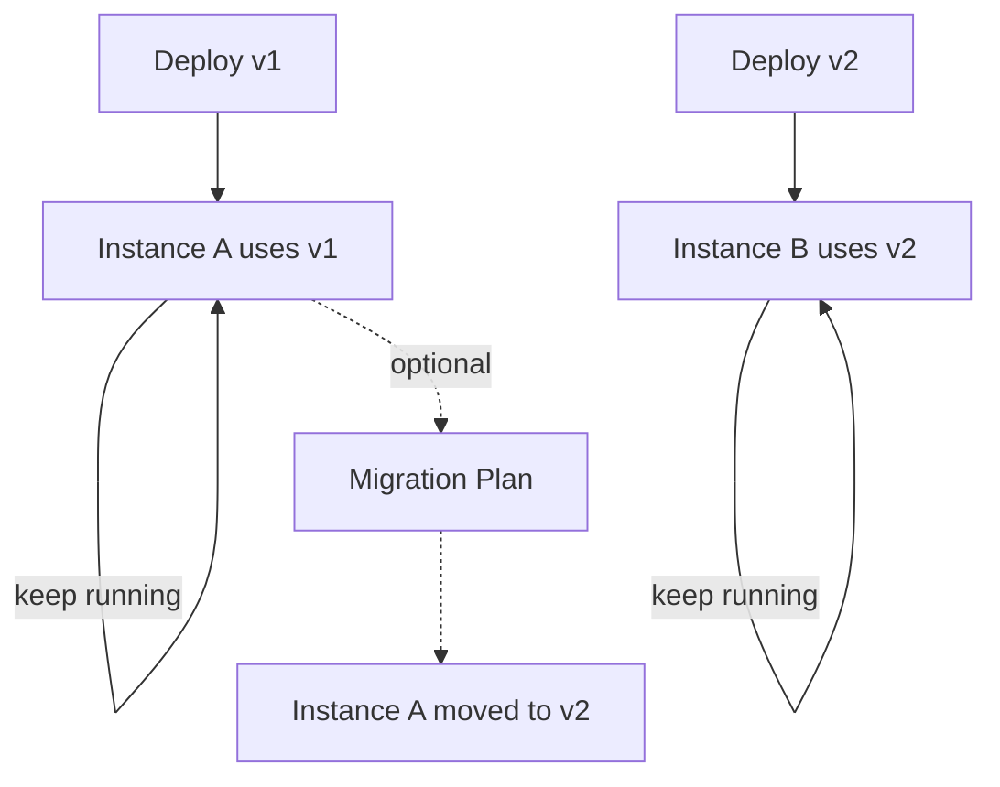

# 06 - 部署版本、流程升級與 Migration 思路

目標：理解流程的版本如何產生、如何在不破壞進行中實例的情況下演進。

## 1) 流程版本怎麼來

同一個流程 key（例如 `hello-user-task`）：

- 每次部署新的 BPMN，都會產生新版本
- 新啟動的實例通常會使用最新版本（依設定/啟動方式）
- 舊版本的實例會繼續跑在舊的流程定義上

## 2) 為什麼流程升級麻煩

因為「進行中」的流程實例可能卡在：

- 某個 user task 還沒完成
- 外部系統等待中
- 某個分支路徑上

如果你直接改 BPMN 結構：

- 舊實例可能無法「自然」走到新結構

## 3) Migration（遷移）的基本觀念

Camunda 7 提供 migration 能力（把正在跑的實例從舊版本移到新版本）。

你需要：

- 建立 migration plan（舊活動 → 新活動的對應）
- 評估哪些變更可以自動對應、哪些需要人工介入

## 4) 實務建議（學習版）

- 先用小步部署（少量變更）累積經驗
- 把「相容性」當成設計目標：
  - 盡量不要移除正在使用的活動
  - 新增活動通常比重排/刪除安全

## 流程圖：版本演進與實例

## 檢核點

- 你知道「版本」是部署行為的結果
- 你知道舊實例不會自動切到新版本
- 你知道 migration 需要對應規劃
