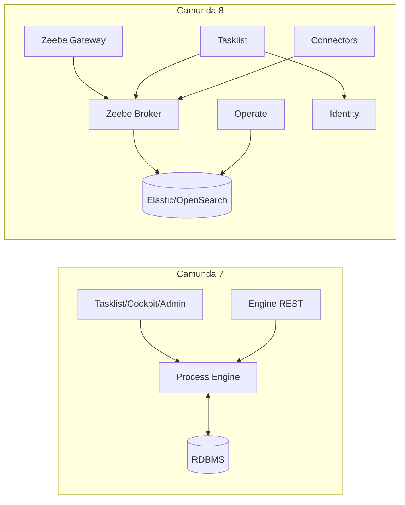

# 08 - Camunda 8 與 Camunda 7 的差異（架構/執行模式）

## 目標

在你已經理解 Camunda 7 後，用最少成本理解 Camunda 8 的核心差異，避免把 7 的假設直接套到 8。

## 一句話差異

- Camunda 7：以「流程引擎 + 關聯式資料庫」為核心（Webapps 直接操作引擎）
- Camunda 8：以「Zeebe 分散式工作flow引擎（Broker）」為核心（以 jobs 驅動，周邊元件分工）

## 架構對比（概念圖）

## 執行模型的差異

### Camunda 7

- 引擎執行 BPMN
- Service Task 可能是：
  - Java Delegate（引擎內）
  - External Task（引擎外）

### Camunda 8

- BPMN 仍是主流建模方式（另有 DMN 等）
- 主要以 **Job Worker**（外部 worker）來做自動化
- 更偏「事件/工作驅動」的模型

## 常見對應（直覺版）

- Camunda 7 External Task ≈ Camunda 8 Job Worker（概念相近）
- Camunda 7 Cockpit（runtime 操作）≈ Camunda 8 Operate（觀測與操作）
- Camunda 7 Tasklist ≈ Camunda 8 Tasklist（但背後架構不同）

## 你在學習上要注意什麼

- 不要期待 Camunda 8 會像 Camunda 7 一樣「直接連一個引擎 + DB」就完整運作
- Camunda 8 的觀測、搜尋、操作通常依賴額外元件（例如 Operate + Elastic/OpenSearch）
- 多元件代表：
  - 部署複雜度更高
  - 但也帶來更好的延展性（適合高吞吐）

## 檢核點

- 你知道 Camunda 8 的核心是 Zeebe（broker/gateway）
- 你知道 Camunda 8 的自動化主要靠 Job Worker
- 你知道 8 的周邊元件（Operate/Tasklist/Connectors）是分工架構

## 下一步

繼續到 [09 - Camunda 8 延伸：Worker、Operate、Connectors、遷移建議](09-camunda8-extensions.md)。
