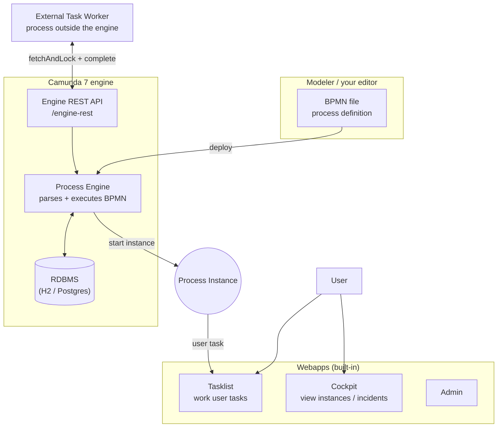
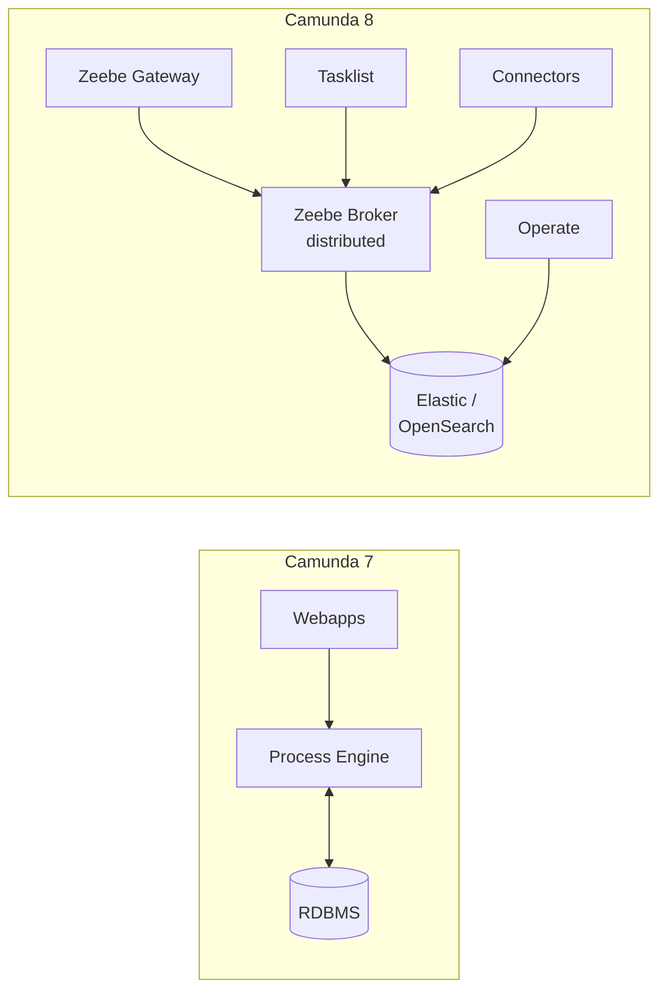
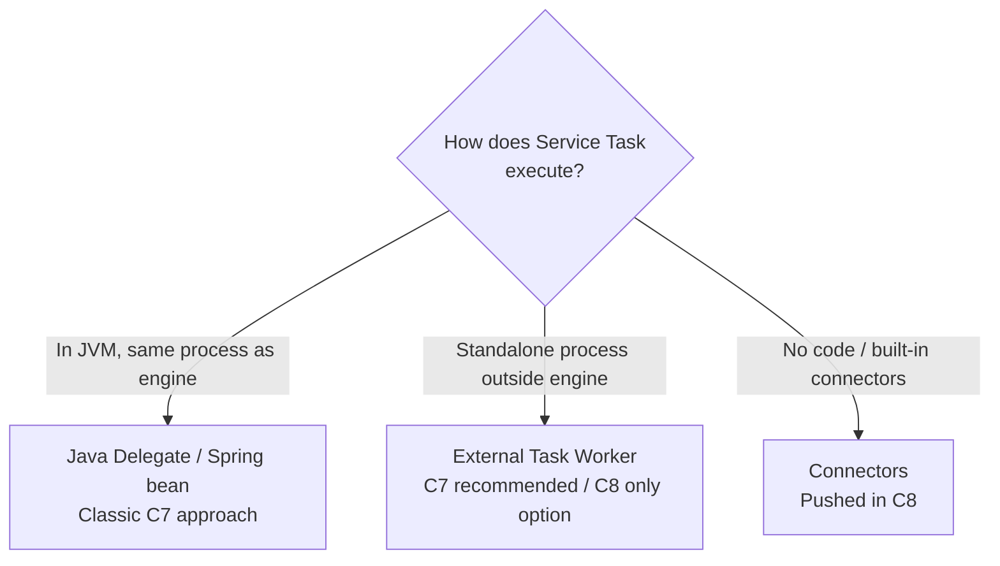

# 00 — Overview: Where to start

For your first time with Camunda: a single picture for the core concepts, a Camunda 7 vs 8 cheat sheet, and which path to take.

## 1. Camunda in one picture

**Five must-know terms**: BPMN (model) → Process Definition (deployed version) → Process Instance (one running execution) → Task (user or external) → Worker (program that runs external tasks).

## 2. Camunda 7 vs 8 cheat sheet

| Aspect | Camunda 7 | Camunda 8 |
| --- | --- | --- |
| Core | Single engine + RDBMS | Zeebe (distributed) + multiple components |
| Automation | Java Delegate (in-process) / External Task | **Job Worker** (external only) |
| Deploy complexity | One docker compose | Many components (broker / gateway / Operate / ES) |
| Best for | Learning, embed in Java apps | High throughput, cloud-native |

> This tutorial focuses on **Camunda 7** (chapters 01–08) and ends with 09–10 comparing Camunda 8. For greenfield projects without legacy concerns, **learning Camunda 8 directly is often the better choice**; but Camunda 7 is more intuitive to start with.

## 3. Three models for "automated steps"

| Model | When to pick |
| --- | --- |
| **Java Delegate** | Your app is already Spring Boot + Camunda and wants to call internal services directly |
| **External Task** | Workers might be Node / Python / other services; loose coupling |
| **Connectors** | Common protocols (HTTP / Slack / DB) without writing your own worker |

## 4. Learning path

```mermaid
flowchart LR
  s00[00 Overview] --> s01[01 Core concepts]
  s01 --> s02[02 Docker quickstart]
  s02 --> s03[03 First process deploy]
  s03 --> s04[04 Tasklist & forms]
  s04 --> s05[05 External task pattern]
  s05 --> s06[06 Variables / errors / retries]
  s06 --> s07[07 Versioning & migration]
  s07 --> s08[08 Debugging & ops]
  s08 --> s09[09 Camunda 8 differences]
  s09 --> s10[10 Camunda 8 extensions]
```

After **01 → 03** you can run a user task; **04 → 06** make it usable; **07 → 08** add operations; **09 → 10** look back from Camunda 8.

## 5. Glossary

| Term | Meaning | Easy mistake |
| --- | --- | --- |
| **BPMN** | Process modeling standard (XML in .bpmn files) | Distinct from DMN (decision tables) and CMMN (case management) |
| **Process Definition** | Deployed "blueprint" with key + version | Same key redeployed creates new version |
| **Process Instance** | One execution with its own variables and state | Don't conflate with process definition |
| **Task** | A waiting step in the process | user task (for people) vs service task (for code) |
| **Job vs Task** | Camunda's "job" is an async unit (timers, async continuations); user tasks aren't jobs | C8's "Job Worker" name comes from this |
| **External Task** | Service task with `external` type, fetched by an external worker | Not "an engine on another machine" |
| **Topic** | Label that external task workers subscribe to | Same idea as a message queue topic |
| **Incident** | Engine ran out of retries, needs human intervention | Visible in Cockpit |
| **BPMN Error vs Incident** | BPMN error is modeled (boundary event handles it); incident is unhandled | Workers must distinguish |
| **Variables** | Process instance data, typed (String / Long / JSON / Object) | Object serialization breaks compatibility on upgrades |

## 6. Prerequisites

You **don't** need: BPMN or Camunda experience.

You **should** know:

- HTTP / REST (you'll call the Engine REST API)
- Docker basics
- A scripting language for workers (Node / Java / Python work; this tutorial uses Node for examples)

## 7. Before you start

1. Install **Docker Desktop**
2. Make sure port `8090` (Camunda 7) is free
3. Open [01-core-concepts.md](./01-core-concepts.md)

## 8. When stuck

→ [troubleshooting.md](./troubleshooting.md): decision trees for "process won't start", stuck user task, External Task not picked up, incidents, and more.
