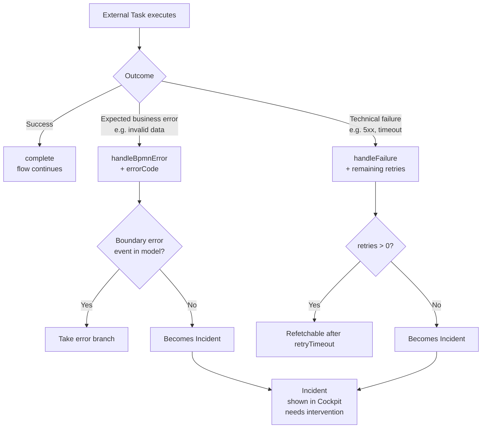

# 06 - Variables, errors, and retries

## Goal

Use variables safely and understand BPMN Error vs Failure vs Incident.

## 1) Variables

Variables are runtime data. You can set/update them when:

- starting a process
- completing a user task / external task
- inspecting in Cockpit (runtime/history varies by UI)

Recommendations:

- prefer simple types (String/Number/Boolean)
- keep variable names stable across versions

## 2) BPMN Error vs Failure vs Incident

| Term | When | Outcome |
| --- | --- | --- |
| **BPMN Error** | Expected business error (invalid data, insufficient credit) | Flow takes error branch (model must have a boundary error event) |
| **Failure** | Transient technical failure (API down, 5xx) | Retried until retries are exhausted |
| **Incident** | Neither handled | Flow stuck; Cockpit intervention needed |

### Details

- **BPMN Error**: a modeled error caught by a boundary error event; great for alternate flows.
- **Failure**: External Task workers call `handleFailure` with `retries` and `retryTimeout`.
- **Incident**: engine failure not absorbed by model/retry; needs human intervention (fix data, fix config, retry).

## 3) External Task retries mindset

A typical strategy:

- start retries at 3
- decrement on each failure
- set a retry timeout (next time the job becomes fetchable)

## Checklist

- You can explain BPMN Error vs Incident
- You know workers control retries for External Tasks
- You understand variables are core process state

## Next

Continue to [07 - Versioning and migration mindset](07-versioning-and-migration.md).
