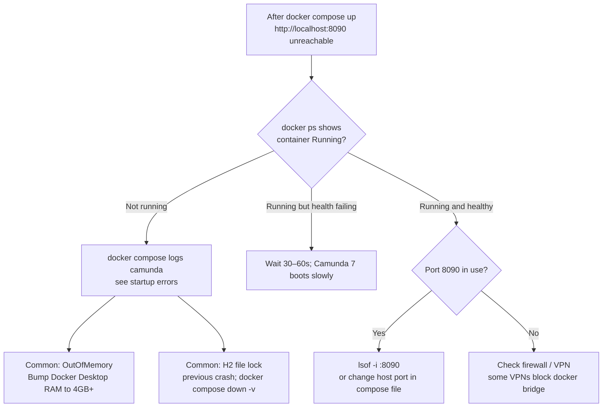
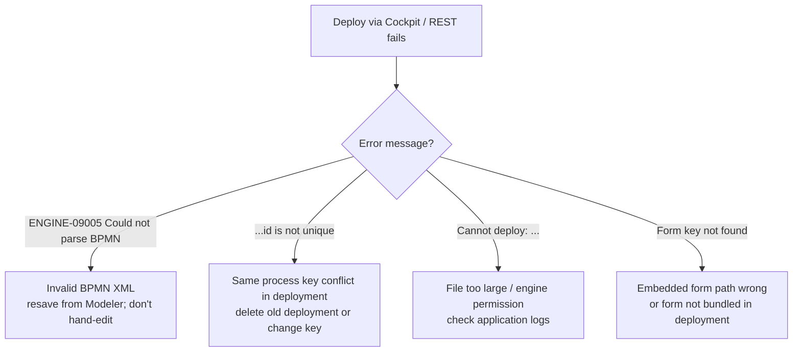
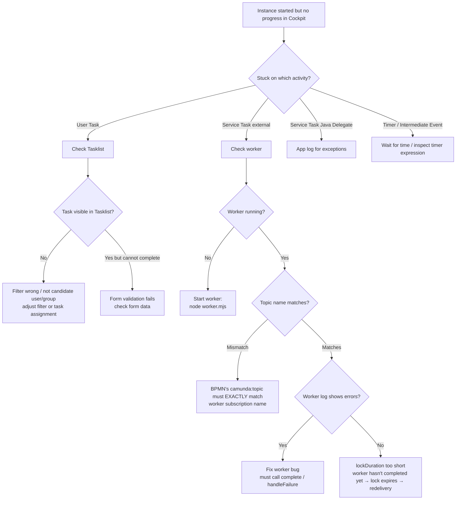
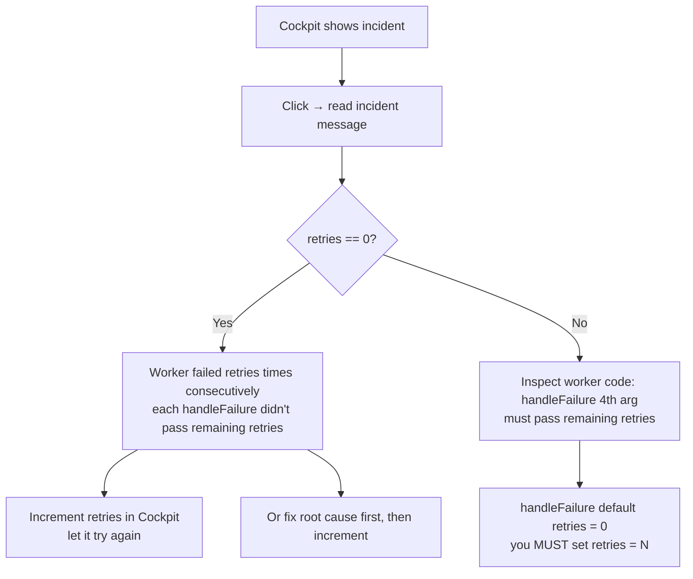
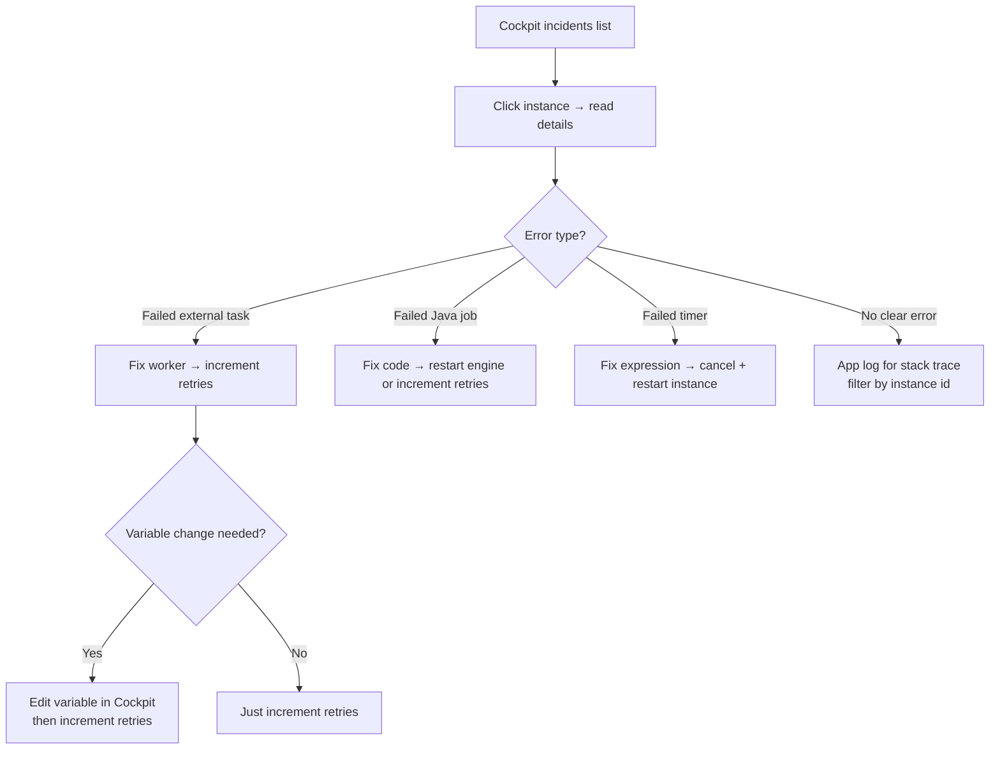
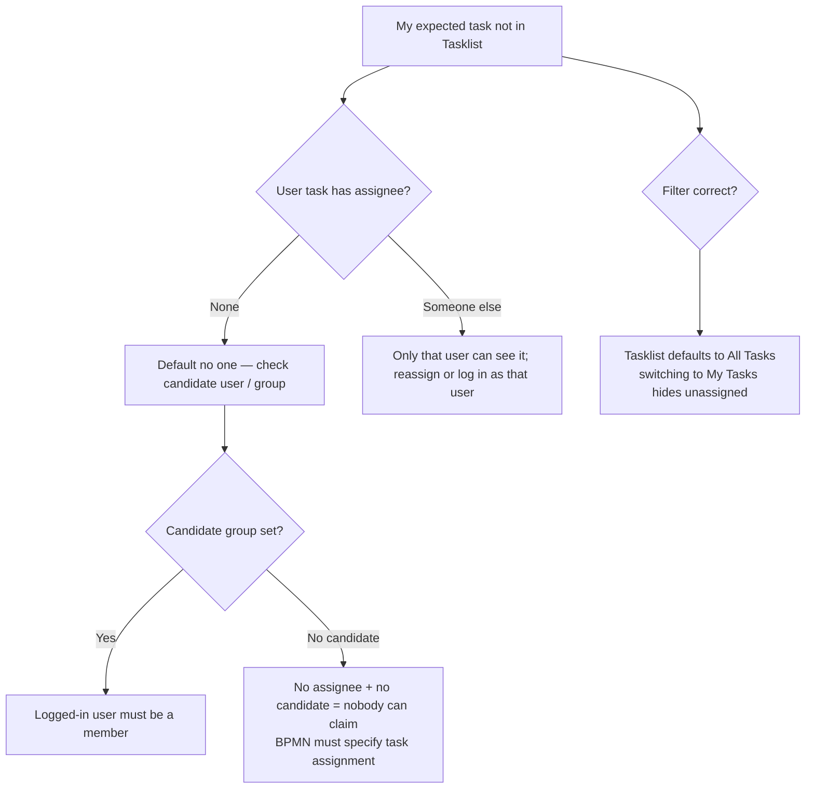

# Troubleshooting: decision trees for Camunda

> First move: open **Cockpit** (http://localhost:8090/camunda/app/cockpit) to inspect process instances and incidents. If there's no incident but the process isn't moving, it's usually a user task no one claimed or an external task worker that isn't running.

## 1. Camunda won't start / web UI unreachable

## 2. BPMN deploy fails

## 3. Process started but "stuck"

## 4. External Task keeps becoming an Incident

> Template: `handleFailure(taskId, workerId, "msg", retries=3, retryTimeout=60_000)`. **Forgetting retries** is the #1 cause.

## 5. Weird variable behavior

| Symptom | Usual cause |
| --- | --- |
| Variable reads as `null` | Not yet set at this step, or wrong scope (local vs global) |
| Updated a variable but next step still sees the old value | Used local scope when global expected, or vice versa |
| Java Delegate changes don't persist | Mutated map from `execution.getVariables()` without calling `setVariable` |
| Object serialization error | Camunda 7 defaults to Java serialization; jar mismatch breaks it. Use JSON or String |
| `OptimisticLockingException` | Concurrent modification of same instance (worker race). Just retry |

## 6. Incident handling flow

## 7. Tasklist doesn't show my task

## 8. Camunda 8 (Zeebe) equivalents

If you've moved to Camunda 8:

| C7 symptom → C8 equivalent |
| --- |
| External task not picked up → Job worker not subscribed to the correct type |
| Incident in Cockpit → Incident in **Operate**; you must resolve before flow continues |
| Engine REST → Zeebe gRPC (use zbctl or client lib); no equivalent REST endpoint |
| H2 / Postgres → No RDBMS; data lives in Zeebe partitions + Elastic |

## 9. Still stuck

1. **Cockpit instance detail**: Activity Instance Tree shows the path taken
2. **Open history**: Cockpit's History tab shows the full execution trail
3. **`docker compose logs -f camunda`** filtered by instance id
4. **Beef up worker logging**: print task id, topic, variables, result
5. **[Camunda Forum](https://forum.camunda.io/)** — active community
