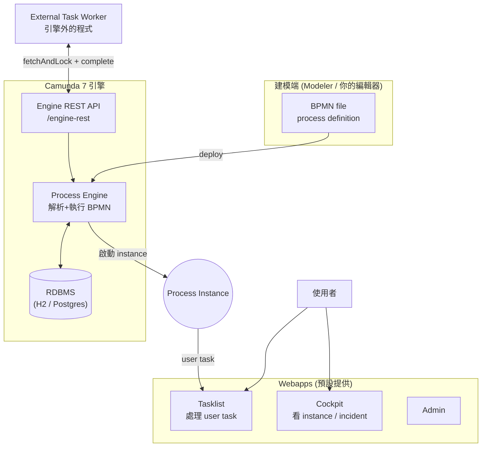
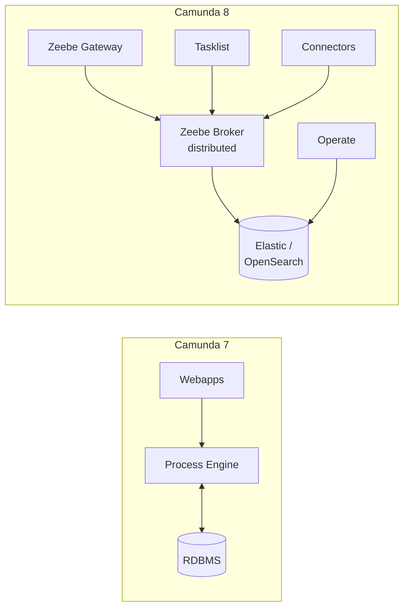
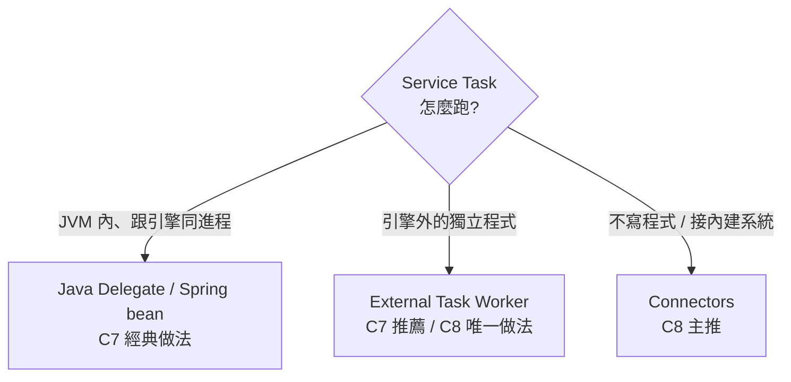

# 00 — 總覽：從哪裡開始

第一次接觸 Camunda？這篇給你一張圖看完核心概念、一份 Camunda 7 vs 8 的速覽，以及該走哪條路。

## 1. Camunda 一張圖

**5 個必懂名詞**：BPMN（流程模型）→ Process Definition（部署上去的版本）→ Process Instance（執行中的一條）→ Task（user 或 external）→ Worker（做 external task 的程式）。

## 2. Camunda 7 vs Camunda 8 速覽

| 面向 | Camunda 7 | Camunda 8 |
| --- | --- | --- |
| 核心 | 單一引擎 + RDBMS | Zeebe（分散式）+ 多元件 |
| 自動化 | Java Delegate（in-process） / External Task | **Job Worker**（純外部） |
| 部署複雜度 | 一個 docker compose 就跑起來 | 多元件（broker / gateway / Operate / ES） |
| 適合 | 學習、傳統 Java 應用內嵌 | 高吞吐、雲原生 |

> 本教學以 **Camunda 7 為主**（章節 01–08），最後章節 09–10 對照 Camunda 8。新專案若沒有歷史包袱，**通常直接學 Camunda 8** 比較合理；但 Camunda 7 的概念更直覺，容易入門。

## 3. 三種「自動化步驟」的實作模型

| 模型 | 何時選 |
| --- | --- |
| **Java Delegate** | 你的應用本身就是 Spring Boot + Camunda，想直接呼叫內部 service |
| **External Task** | 你的自動化程式可能是 Node / Python / 別的服務；要鬆耦合 |
| **Connectors** | 接 HTTP / Slack / DB 等通用協定，不想自己寫 worker |

## 4. 學習路徑

```mermaid
flowchart LR
  s00[00 Overview] --> s01[01 Core concepts]
  s01 --> s02[02 Docker quickstart]
  s02 --> s03[03 First process deploy]
  s03 --> s04[04 Tasklist & forms]
  s04 --> s05[05 External task pattern]
  s05 --> s06[06 Variables / errors / retries]
  s06 --> s07[07 Versioning & migration]
  s07 --> s08[08 Debugging & ops]
  s08 --> s09[09 Camunda 8 differences]
  s09 --> s10[10 Camunda 8 extensions]
```

最少做完 **01 → 03** 就能跑起來一個 user task；**04 → 06** 是把它變成可實用；**07 → 08** 是維運；**09 → 10** 是回頭看 Camunda 8。

## 5. 詞彙表

| 詞 | 意義 | 容易混淆 |
| --- | --- | --- |
| **BPMN** | 流程建模標準（XML 格式 .bpmn） | 跟 DMN（決策表）、CMMN（case management）不同 |
| **Process Definition** | 部署到引擎後的「藍圖」，有 key + version | 同一個 key 多次 deploy 會疊版本 |
| **Process Instance** | 一次「執行」，有自己的 variable 與狀態 | 跟 process definition 不要搞混 |
| **Task** | 流程中等待處理的步驟 | user task（給人）vs service task（給程式） |
| **Job vs Task** | Camunda 內部 job 是「待執行的非同步單元」（包含 timer、async continuation 等）；user task 不是 job | C8 的 "Job Worker" 取自此 |
| **External Task** | service task 設成 `external` 型，由引擎外 worker 抓取 | 不是「另一台機器跑的引擎」 |
| **Topic** | External task worker 訂閱的標籤 | 像 message queue 的 topic 概念 |
| **Incident** | 引擎執行失敗、retries 用完、需要人介入 | 在 Cockpit 看到 |
| **BPMN Error vs Incident** | BPMN error 是模型預期會發生（boundary event 接得到）；incident 是非預期 | 寫 worker 時要分清楚 |
| **Variables** | 流程實例的資料，有 type（String / Long / JSON / Object） | 用 Object 序列化要小心相容性 |

## 6. 前置知識

讀這份**不需要**：BPMN 經驗、Camunda 經驗。

讀這份**最好已經懂**：

- HTTP / REST 基本（要呼叫 Engine REST API）
- Docker 基本
- 至少一種程式語言能寫 worker（Node / Java / Python 都行；本教學的 worker 範例用 Node）

## 7. 動手前要做的事

1. 裝好 **Docker Desktop**
2. 確認 port `8090`（Camunda 7）沒被佔用
3. 從 [01-core-concepts.md](./01-core-concepts.md) 開始

## 8. 卡住時去哪

→ [troubleshooting.md](./troubleshooting.md)：流程啟動失敗、卡 user task、External Task 沒被抓、Incident 等決策樹。
