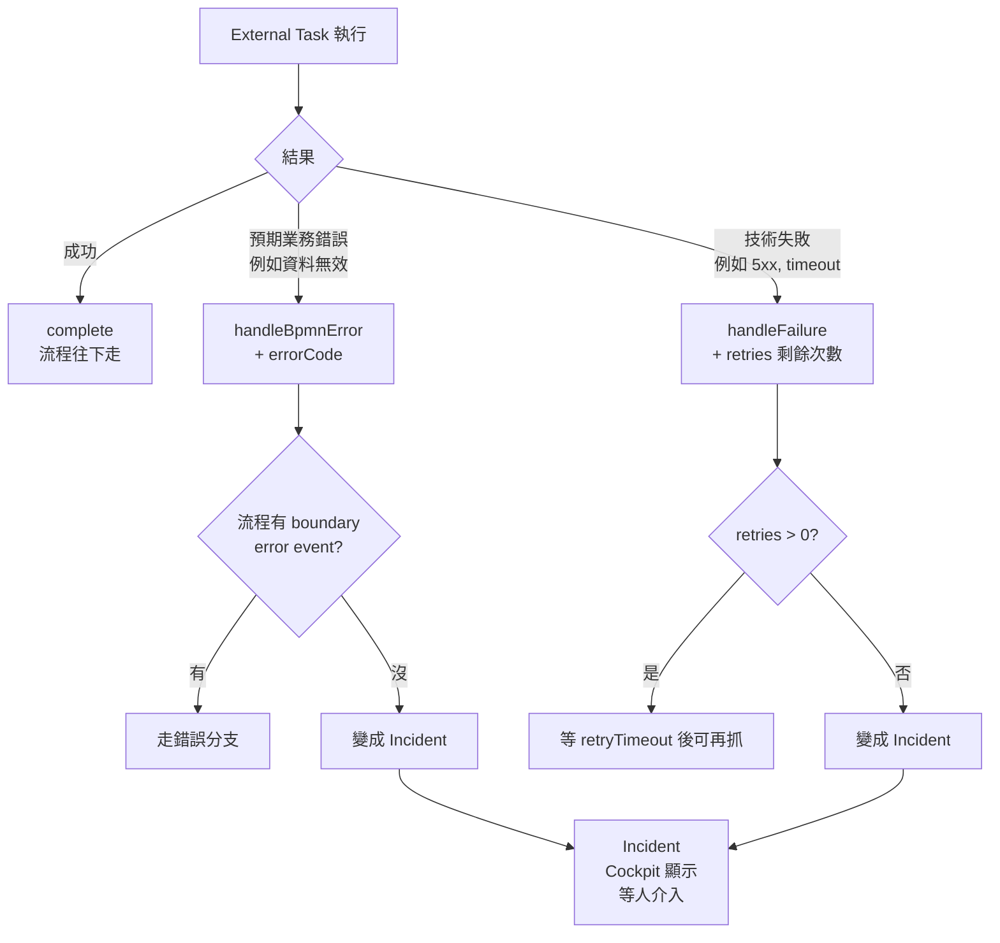

# 06 - 流程變數、錯誤與重試

## 目標

掌握流程變數的使用方式，並理解「錯誤（BPMN Error）」「失敗（Failure）」「事故（Incident）」的差異。

## 1) 變數（Variables）

變數是流程執行時的資料，可在：

- 啟動流程時帶入
- 完成 user task / external task 時更新
- 在 Cockpit 檢視（Runtime/History 視 UI 而定）

### 建議

- 優先用簡單型別：String/Number/Boolean
- 變數命名要一致（跨版本更重要）

## 2) BPMN Error vs Failure vs Incident

| 名詞 | 何時用 | 結果 |
| --- | --- | --- |
| **BPMN Error** | 可預期的業務錯誤（資料不合法、額度不夠） | 流程走錯誤分支（要在模型上設 boundary error event） |
| **Failure** | 暫時性技術失敗（連不上 API、5xx） | retries 用完前可重試 |
| **Incident** | 上面兩種都沒被接起來 | 流程卡住，需要 Cockpit 介入 |

### 細節說明

- **BPMN Error**：你在模型裡設計會發生的錯誤；由 boundary error event 捕捉。
- **Failure**：External Task Worker 可透過 `handleFailure` 設定 retries / backoff。
- **Incident**：引擎執行失敗且沒被流程模型/重試機制處理，需要人工介入（修資料、修設定、重試）。

## 3) External Task 的 retries 思路

一個常見策略：

- retries 初始 3 次
- 失敗就減 1
- 設定 retryTimeout（下次可再抓取的時間）

> 學習階段先能把流程跑通；正式環境要再加上明確的錯誤分類與告警。

## 4) 小練習

1. 用第 05 章的流程啟動時帶入 `demoInput`
2. 修改 worker，讓它把 `demoInput` 讀出並寫入 `demoOutput`
3. 到 Cockpit 檢視該實例變數是否更新

## 檢核點

- 你能解釋 BPMN Error 與 Incident 的不同
- 你知道 retries 應該由 Worker 控制（External Task 模式）
- 你知道變數是流程狀態的重要部分

## 下一步

繼續到 [07 - 部署版本、流程升級與 Migration 思路](07-versioning-and-migration.md)。
