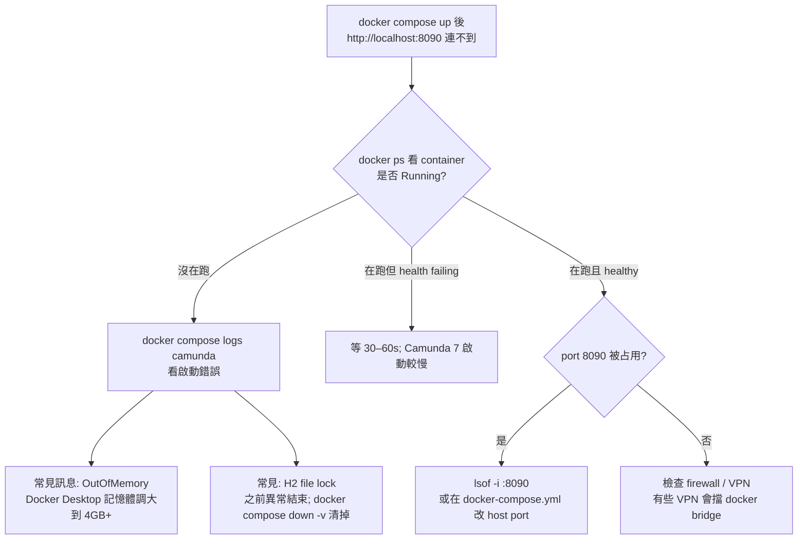
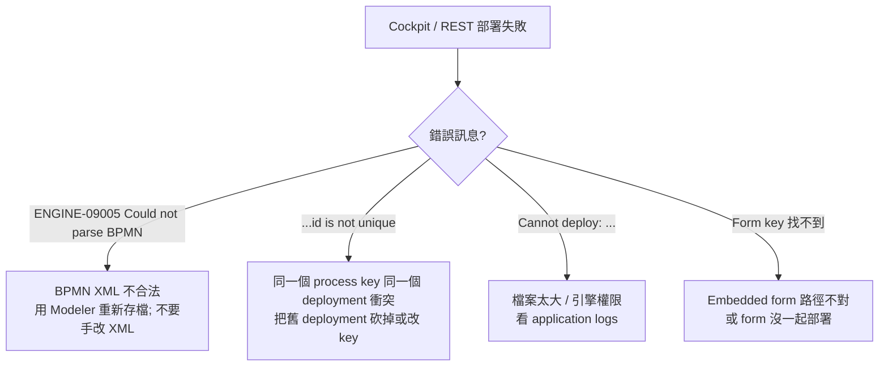
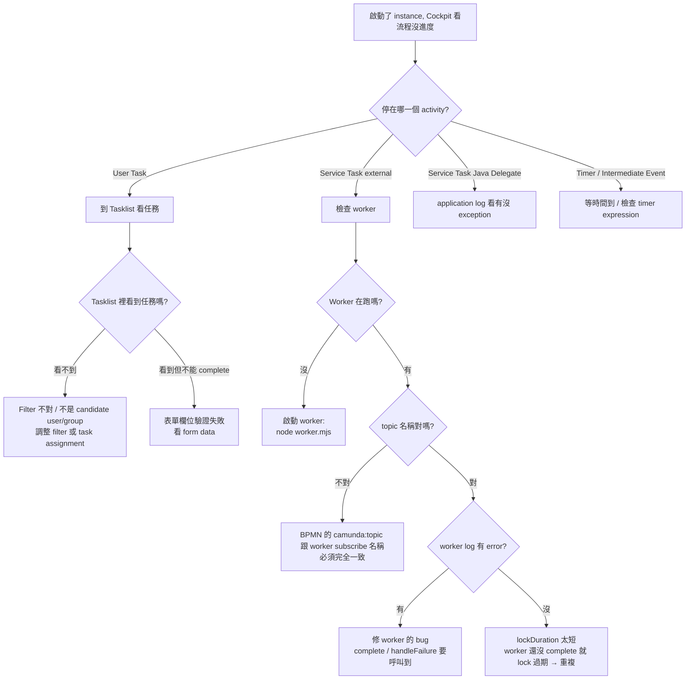
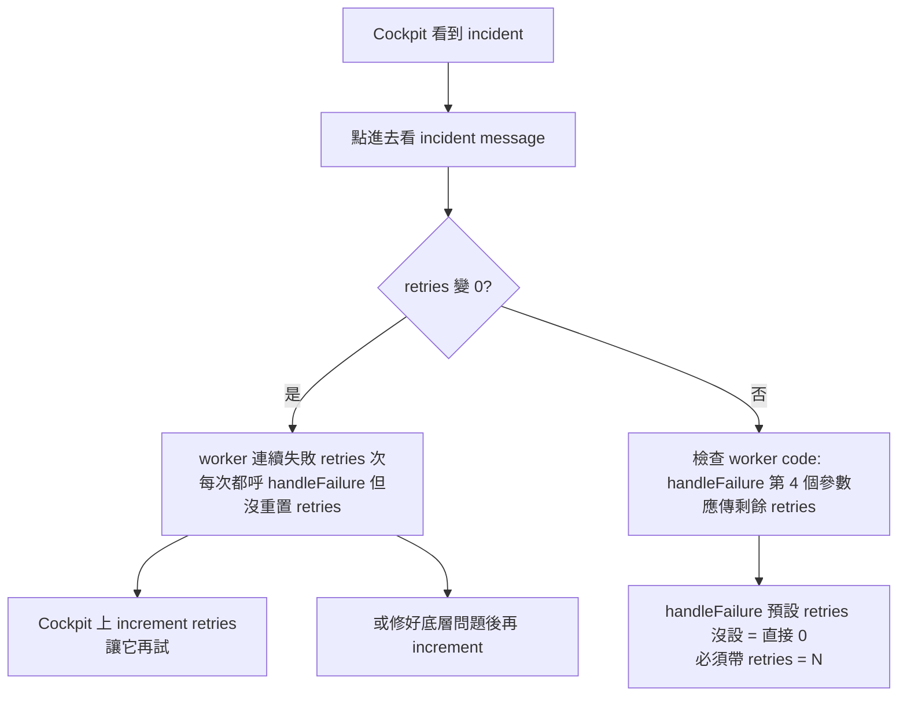
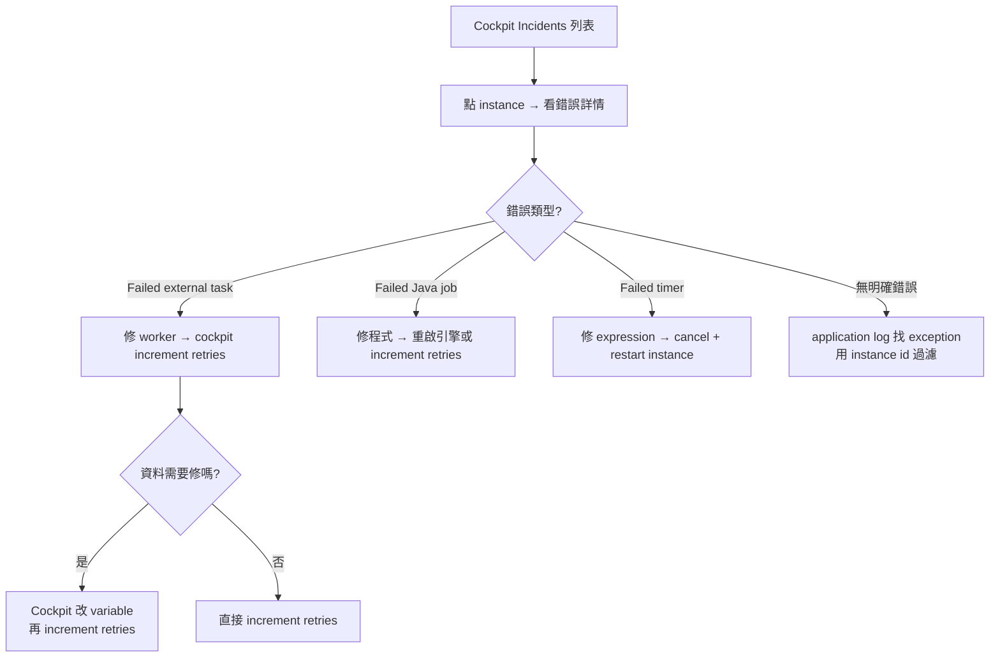
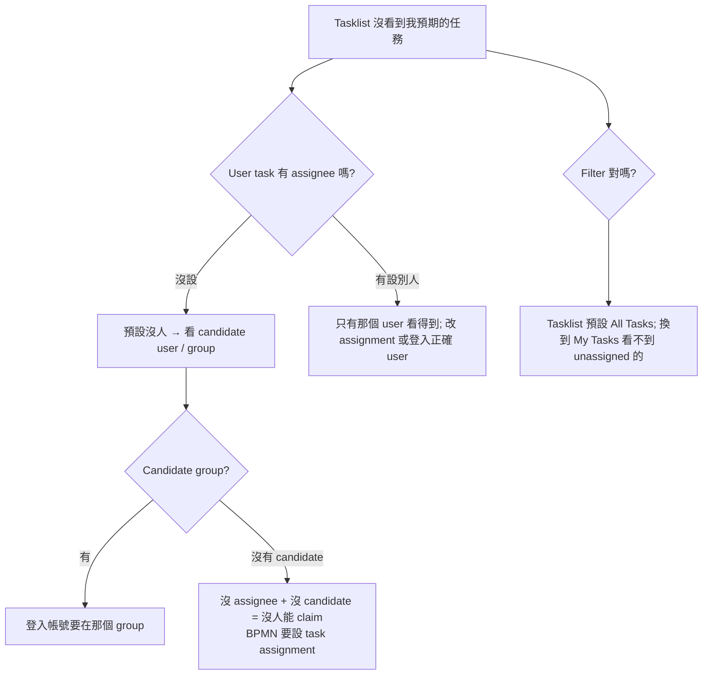

# Troubleshooting：Camunda 常見問題決策樹

> 起手式：先到 **Cockpit**（http://localhost:8090/camunda/app/cockpit）看流程實例與 Incidents。看不到 incident、但流程沒動，多半是 user task 沒人 claim 或 external task worker 沒跑。

## 1. Camunda 起不來 / Web 進不去

## 2. 部署 BPMN 失敗

## 3. 流程啟動但「卡住」

## 4. External Task 一直變 Incident

> 範本：`handleFailure(taskId, workerId, "msg", retries=3, retryTimeout=60_000)`。**忘了設 retries** 是最常見原因。

## 5. Variables 行為怪

| 症狀 | 多半的原因 |
| --- | --- |
| Variable 取出來是 `null` | 流程到那一步時還沒設定；或 scope 不對（local vs global） |
| 改了 variable，下一步取到的還是舊值 | 用了 local scope 但 expect global，或反之 |
| Java Delegate 改 variable 沒生效 | 用了 `execution.getVariables()` 拿到 map 改值，但沒 `setVariable` 寫回去 |
| Object 序列化錯誤 | Camunda 7 預設用 Java 序列化；換 jar 版本就掛。改用 JSON 或 String |
| `org.camunda.bpm.engine.OptimisticLockingException` | 兩個地方同時改同一個 instance（worker 沒處理 race）；retry 即可 |

## 6. Incident 處理流程

## 7. Tasklist 找不到我的任務

## 8. Camunda 8 (Zeebe) 的對應問題

如果你已經在用 Camunda 8：

| C7 症狀 → C8 對應 |
| --- |
| External task 沒被抓 → Job worker 沒 subscribe 到正確 type |
| Incident 在 Cockpit → Incident 在 **Operate**，需要先 resolve incident 才能讓流程繼續 |
| Engine REST → Zeebe gRPC（用 zbctl 或 client lib），沒有同形式的 REST endpoint |
| H2 / Postgres → 沒有 RDBMS；資料在 Zeebe partitions + Elastic |

## 9. 仍找不到原因

1. **看 Cockpit 的 instance 詳情頁**：Activity Instance Tree 顯示走過哪些 activity
2. **打開 history**：Cockpit 的 History 標籤可以看執行軌跡
3. **`docker compose logs -f camunda`** 過濾 instance id
4. **External task worker 加詳細 log**：印出 task id、topic、variables、結果
5. **官方 [Forum](https://forum.camunda.io/)** — Camunda 社群活躍
