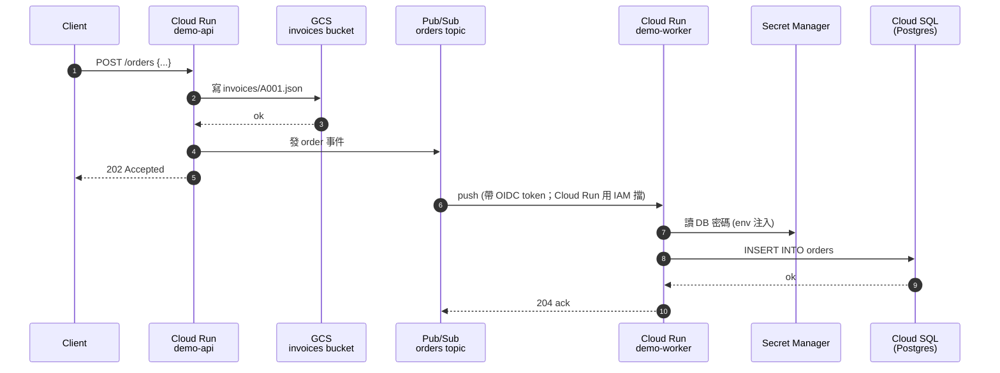

# 端對端示範：訂單小系統

> Language: [English](./README.md) ｜ **中文**

把前面 17 篇教學的 6 個服務串起來的最小可跑範例。重點在**展示彼此怎麼接**，**不是 production-ready** 程式碼。

## 架構



涉及的服務：

- **Cloud Run**（api + worker）
- **Pub/Sub**（push subscription + OIDC 認證）
- **Cloud Storage**（存 invoice）
- **Cloud SQL**（Postgres；理想是 Private IP + Auth Proxy sidecar，這裡為了簡單用 Cloud SQL Connector lib）
- **Secret Manager**（DB 密碼以 env 注入）
- **Artifact Registry**（image 存放）
- **Workload Identity / IAM**（服務全用 runtime SA，沒有 key 檔）

## 目錄

```
demo/
├── README.md              ← 英文版
├── README.zh.md           ← 你在這
├── api/                   ← 訂單接收服務
│   ├── Dockerfile
│   ├── main.py
│   └── requirements.txt
├── worker/                ← Pub/Sub 驅動的 DB 寫入
│   ├── Dockerfile
│   ├── main.py
│   └── requirements.txt
├── terraform/             ← 基礎建設
│   ├── main.tf
│   ├── variables.tf
│   └── outputs.tf
└── deploy.sh              ← build + push image、更新 Cloud Run
```

## 前置作業

- 一個 GCP project，billing 已啟用
- 本機裝好 `gcloud`、`terraform`、`docker`
- `gcloud auth login` 與 `gcloud auth application-default login` 都跑過
- 決定 `PROJECT_ID` 與 `REGION`（預設 `asia-east1`）

## 跑起來

### 1. 設環境變數

```bash
export PROJECT_ID=your-project-id
export REGION=asia-east1
```

### 2. 用 Terraform 開資源

```bash
cd terraform
terraform init
terraform apply -var=project="$PROJECT_ID" -var=region="$REGION"
```

會建立：

- Artifact Registry repo `demo`
- GCS bucket `<project>-demo-invoices`
- Pub/Sub topic `demo-orders` 與 push subscription `demo-orders-sub`
- Cloud SQL Postgres instance `demo-pg` + db `orders` + user `app`
- Secret Manager secret `demo-db-password`
- 兩個 runtime SA（`demo-api`、`demo-worker`），各自最小權限
- Cloud Run service `demo-api` 與 `demo-worker`（初次部署用 `gcr.io/cloudrun/hello` placeholder image）

> 第一次建 Cloud SQL 約 5–10 分鐘。

### 3. Build / push image、重新部署

```bash
cd ..
./deploy.sh
```

`deploy.sh` 會：

1. Build `api/` 與 `worker/` 的 image
2. Push 到 Artifact Registry
3. 更新兩個 Cloud Run service 改用新 image

### 4. 測試

```bash
URL=$(gcloud run services describe demo-api --region="$REGION" --format="value(status.url)")

curl -X POST "$URL/orders" \
  -H "Content-Type: application/json" \
  -d '{"order_id":"A001","amount":120,"item":"book"}'
# → {"status":"accepted","invoice":"gs://.../invoices/A001.json"}
```

看 worker log 與 DB：

```bash
gcloud run services logs read demo-worker --region="$REGION" --limit=20

# Cloud SQL Auth Proxy 或 Console SQL Studio 連進去：
#   SELECT * FROM orders;
```

### 5. 收尾

```bash
cd terraform
terraform destroy -var=project="$PROJECT_ID" -var=region="$REGION"
```

## 這個 demo 要學到什麼

| 主題 | 在哪看 |
| --- | --- |
| Workload Identity / runtime SA | `terraform/main.tf` 每個 Cloud Run 的 `service_account =` 與 IAM bindings |
| Secret Manager 注入 | `terraform/main.tf` 的 `env { value_source { secret_key_ref ... }}` |
| Pub/Sub push + OIDC 驗證 | `terraform/main.tf` 訂閱的 `oidc_token { service_account_email }`；worker 上**只有** `pushinvoker` SA 有 `roles/run.invoker`，Cloud Run 在程式跑之前就會把其他來源擋掉 |
| Cloud Run 連 Cloud SQL | `worker/main.py` 用 `cloud-sql-python-connector` |
| Cloud Run 寫 GCS | `api/main.py` 用 `google-cloud-storage` 走 ADC |
| 每個服務最小權限 | `terraform/main.tf`：api SA 只給 `pubsub.publisher`、worker SA 只給 `cloudsql.client` |

## 提醒

- 沒有測試、沒有 migration、沒有健康檢查、沒有 graceful shutdown。
- `db_password` 由 Terraform 隨機產生；正式環境用 Secret Manager rotation event 自動換。
- Cloud SQL 為了簡化用 **public IP**。Production 改 Private IP + Cloud SQL Auth Proxy sidecar 或 PSC。
- 沒接 Cloud Build / Cloud Deploy；`deploy.sh` 是最陽春的部署腳本。要做正式 pipeline 看 [16-cicd.md](../zh/16-cicd.md)。
- 單一 region。Production 把所有 resource 對齊同 region，並考慮 DR。
