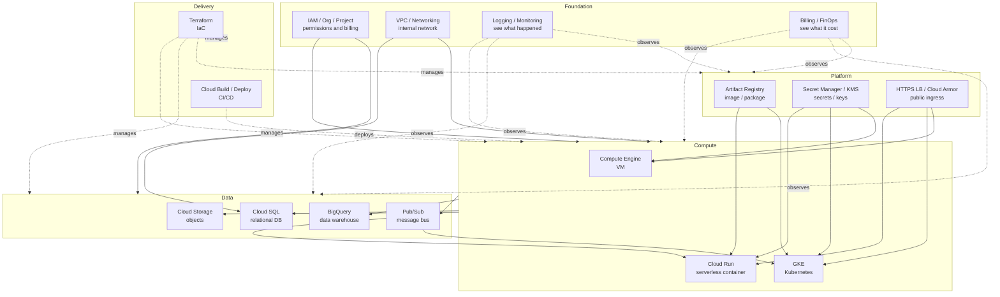
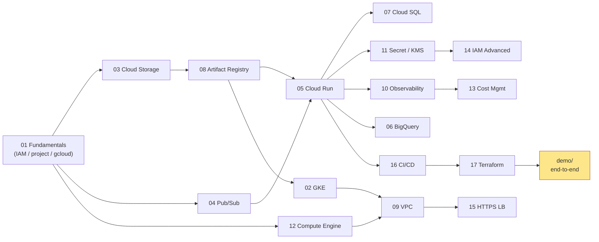
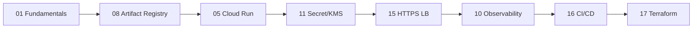
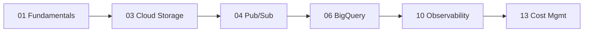
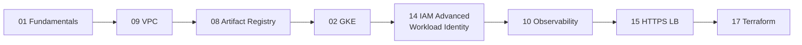

# 00 — Overview: Where to start

For readers **opening GCP for the first time**. One diagram for how all the topics relate, plus a reading order that won't confuse you.

## 1. GCP service landscape (one picture)



**How to read**: foundation (IAM, network, observability, billing) holds everything up; compute does work; data stores it; platform manages secrets and ingress; delivery automates it.

## 2. Topic number ↔ service ↔ when to read



> Numbers are a **suggested order**, not a strict dependency. Skip around if you need to. The yellow `demo/` assumes you've read the rest.

## 3. Three learning paths

Pick one; saves half the time:

### 🚀 Path A: "Ship a web service to GCP"

Shortest path to production:



You can skip GKE / GCE / Pub/Sub / BigQuery for now.

### 📊 Path B: "Build a data analytics platform"



**13 Cost Mgmt is critical for BQ** — a single `SELECT *` can cost hundreds of dollars.

### ☸️ Path C: "I know K8s, moving to GKE"



## 4. Glossary (the easily-confused)

| Term | What it is | Common misconception |
| --- | --- | --- |
| **Project** | Unit of billing / IAM / APIs (every resource belongs to one) | Confused with Folder / Org; Project ID (string) and Project Number (digits) both exist |
| **Service Account (SA)** | Identity for programs; an IAM principal | Not a "service config file"; **GCP SA email is different from K8s ServiceAccount** |
| **ADC** | Application Default Credentials | Not a file — the SDK's credential lookup order |
| **Workload Identity** | Lets GKE Pods / Cloud Run auto-fetch a GCP identity | Don't confuse with Workload Identity Federation (WIF, for external identities) |
| **Region / Zone** | Region = geographic area (asia-east1); Zone = a datacenter inside a region (asia-east1-a/b/c) | GCS bucket calls it "location" but uses region names |
| **Tag vs Label** | Label = pure tagging (billing/search); Tag = has IAM model, usable in Org Policy conditions | Both terms used loosely — easy to mix up |
| **GCS Class A vs B ops** | A = writes (PUT, LIST); B = reads (GET) | A is 10x+ pricier than B — many small uploads hurt |
| **VPC (GCP)** | A **global** object; only subnets are bound to a region | Different from AWS — one VPC can span regions |
| **Egress** | Outbound traffic | Cross-region or internet egress is the expensive kind; intra-region is mostly free |
| **CMEK / CSEK** | CMEK = customer-managed key (KMS); CSEK = customer-supplied key | CMEK covers 99% of cases; CSEK is rarely used |

## 5. Prerequisites

You **don't** need: GCP experience.

You **should** know:

- Basic Linux / shell (`cd`, `curl`, env vars)
- Basic networking (IP, DNS, TLS, HTTP status codes)
- Basic Docker (image, container, Dockerfile)
- Basic Git / GitHub

If you're new to K8s, skip the hands-on parts of 02-gke for now — concepts are still useful.

## 6. Three things to do before any hands-on

1. **Create a dedicated GCP project**: don't reuse a real project; experiments can delete things.
2. **Set budget alerts**: Console → Billing → Budgets. Tiered alerts at $10 / $20 / $50.
3. **Install gcloud + run two logins**:
   ```bash
   gcloud auth login                       # for CLI
   gcloud auth application-default login   # for SDKs / Terraform
   ```

Then start with [01-fundamentals](./01-fundamentals.md).

## 7. When you're stuck

- **Permission / command errors**: see the decision trees in [`troubleshooting.md`](./troubleshooting.md).
- **Concept questions**: every topic ends with "Common pitfalls" — usually the exact bug a beginner hits.
- **Official docs**: `https://cloud.google.com/<service>/docs` (e.g. `/run/docs`).
- **Search tip**: prefix `site:cloud.google.com` to filter out clickbait.
