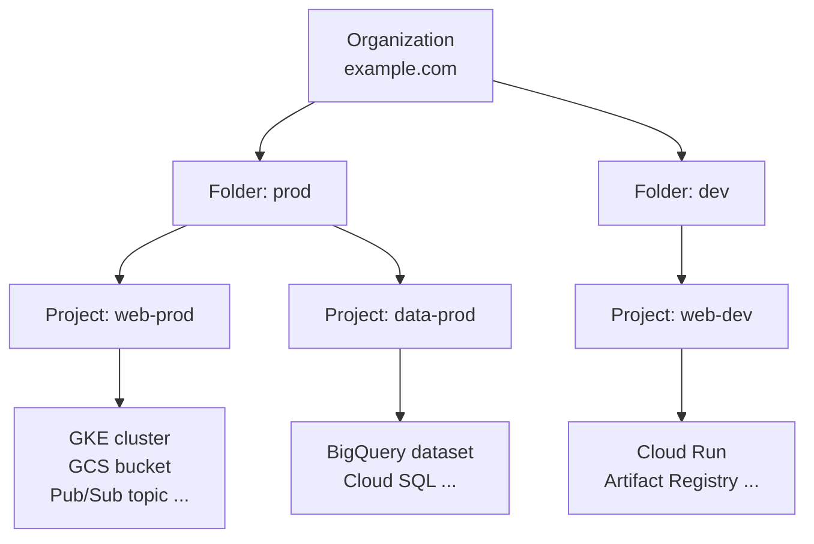

# GCP Fundamentals

Before touching any service, you need to understand GCP's resource layout and identity / permission model. Without this, `permission denied` errors will be miserable.

## 1. Resource hierarchy



Key idea: **permissions inherit downward** along this tree. A role granted on a Folder is effective on every project below it.

- **Project** is the unit of billing and permissions. Every resource belongs to one.
- One account can own many projects; usually you'll want at least `dev` / `prod`.
- Projects have two identifiers:
  - **Project ID** (immutable, globally unique, e.g. `my-app-prod-2026`) — what CLI commands use.
  - **Project Number** (numeric, auto-generated) — used by IAM service accounts and similar.

## 2. IAM (Identity and Access Management)

GCP permission formula: **Principal + Resource + Role**.

```mermaid
flowchart LR
  subgraph principals[Principal<br/>who]
    U[user:alice@…]
    G[group:dev@…]
    SA[serviceAccount:<br/>app@…]
    DOM[domain:example.com]
  end

  subgraph binding[IAM Binding<br/>ties them together]
    B((member +<br/>role +<br/>resource))
  end

  subgraph roles[Role<br/>set of permissions]
    R1[Predefined<br/>roles/storage.objectViewer]
    R2[Custom]
    R3[Basic<br/>owner/editor/viewer<br/>avoid]
  end

  subgraph resource[Resource<br/>what to act on]
    Org2[Org]
    Folder2[Folder]
    Proj[Project]
    Single[Single resource<br/>bucket / topic ...]
  end

  principals --> B
  roles --> B
  B --> resource
```

- **Principal** can be a user account, Google Group, Service Account, or domain.
- **Role** is a set of permissions, in three flavors:
  - **Basic**: `roles/owner`, `roles/editor`, `roles/viewer` — too broad; avoid in production.
  - **Predefined**: service-specific, e.g. `roles/storage.objectViewer`, `roles/pubsub.publisher` — **default choice**.
  - **Custom**: assemble your own permissions; for platform / security teams.
- Permissions are **additive** and bound at any level (Organization / Folder / Project / Resource); lower levels inherit from higher.

### Service Account (SA)

- Identity for **programs**, not humans.
- Two ways to use:
  - **Runtime identity**: GKE Workload Identity, Cloud Run runtime SA. App gets short-lived tokens, **no key file needed**.
  - **Key file**: `gcloud iam service-accounts keys create key.json` — convenient but risky. Avoid if possible.

```bash
# Example: grant an SA read access to a bucket
gcloud storage buckets add-iam-policy-binding gs://my-bucket \
  --member="serviceAccount:my-app@my-project.iam.gserviceaccount.com" \
  --role="roles/storage.objectViewer"
```

## 3. Essential `gcloud` CLI tricks

### 3.1 Switching configurations

When juggling multiple projects / environments, use configurations:

```bash
gcloud config configurations create dev
gcloud config set project my-app-dev
gcloud config set account me@example.com

gcloud config configurations create prod
gcloud config set project my-app-prod

gcloud config configurations activate dev   # switch
gcloud config configurations list
```

### 3.2 Inspect identity / permissions

```bash
gcloud auth list                              # current logged-in accounts
gcloud config list                            # current config
gcloud projects get-iam-policy MY_PROJECT     # full IAM policy
gcloud projects describe MY_PROJECT
```

### 3.3 `--format` / `--filter`

`gcloud` defaults are human-friendly but bad for scripts. Use `--format`:

```bash
# Just cluster names
gcloud container clusters list --format="value(name)"

# Specific zone, JSON output
gcloud compute instances list \
  --filter="zone:asia-east1-b AND status=RUNNING" \
  --format=json
```

## 4. Billing concepts

| Dimension | Examples |
| --- | --- |
| Compute time | GKE node, Cloud Run vCPU-seconds |
| Storage | GCS GB-month, Persistent Disk |
| Network egress | Cross-region and internet egress are most expensive |
| Operations | GCS Class A/B operations, Pub/Sub messages |

> **Common landmines**: cross-region traffic / bucket in wrong region / forgetting to delete test cluster.

Set a budget alert:

```text
Console → Billing → Budgets & alerts → Create budget
  Scope: select project
  Amount: e.g. $20/month
  Threshold: 50%, 90%, 100% (you'll get email alerts)
```

## 5. Application Default Credentials (ADC)

When SDKs call GCP APIs, they search in order:

1. Env var `GOOGLE_APPLICATION_CREDENTIALS` pointing to a key file
2. User credentials from `gcloud auth application-default login`
3. Metadata server on GCE / GKE / Cloud Run (auto SA token)

For local development:

```bash
gcloud auth application-default login
```

After this, Python / Node SDKs work without any env var setup.

## Next

Once you have these basics, pick a service to start with:

- "Simplest cloud service" → [03-cloud-storage.md](./03-cloud-storage.md)
- "Async systems" → [04-pubsub.md](./04-pubsub.md)
- "K8s on GCP" → [02-gke.md](./02-gke.md)
