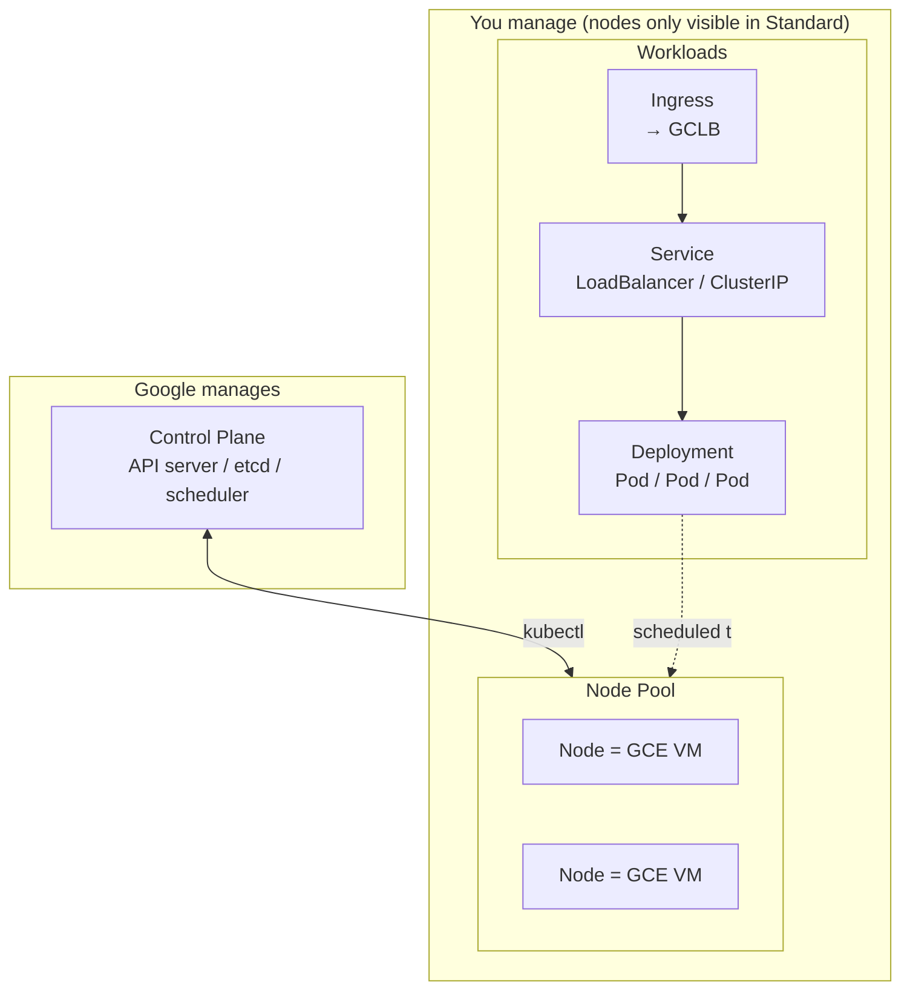
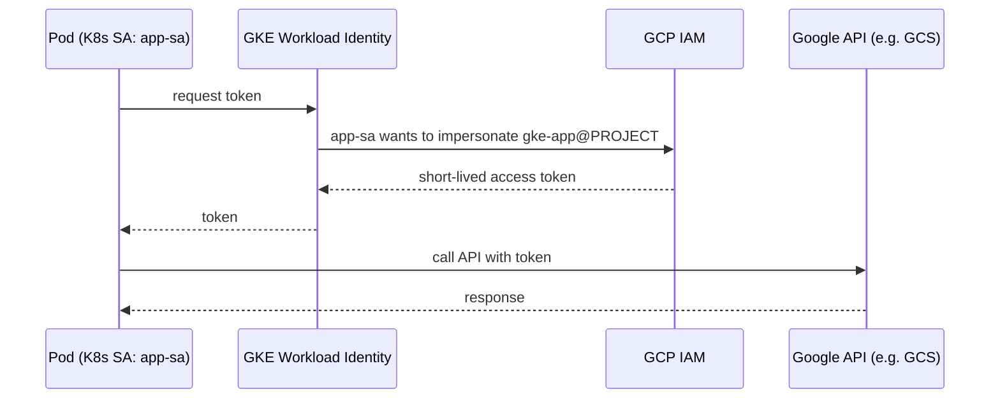

# GKE (Google Kubernetes Engine)

GKE is Google's managed Kubernetes. It handles the control plane (API server, etcd, scheduler) so you only worry about workloads — and, in Standard mode, nodes.



## 1. Standard vs Autopilot

| Aspect | Standard | Autopilot |
| --- | --- | --- |
| You manage | Node pools, machine types, autoscaling | Just Pod specs |
| Billing | Per node VM | Per Pod CPU/Mem/storage |
| Flexibility | High (DaemonSets, custom OS, GPUs) | More restricted (closed system namespace, some features unavailable) |
| Best for | Customization, special workloads | "Serverless K8s", no node management |

New project / don't want to touch nodes → **Autopilot**. Need GPUs, custom DaemonSets, custom kernels → **Standard**.

## 2. Concept mapping

| K8s concept | GKE concrete |
| --- | --- |
| Cluster | Control plane + nodes (in a region/zone) |
| Node | Compute Engine VM (visible in Standard) |
| Pod | Smallest container execution unit |
| Service `LoadBalancer` | Google Cloud Load Balancer (external IP) |
| Ingress | Auto-creates GCLB (HTTP(S) LB) |
| PersistentVolume | Persistent Disk (pd-standard / pd-ssd / pd-balanced) |
| ServiceAccount + Workload Identity | Maps to GCP IAM SA |

## 3. Create a cluster

### Autopilot (recommended for beginners)

```bash
gcloud container clusters create-auto demo-autopilot \
  --region=asia-east1 \
  --release-channel=regular
```

### Standard (zonal, cheap for experiments)

```bash
gcloud container clusters create demo-std \
  --zone=asia-east1-b \
  --num-nodes=2 \
  --machine-type=e2-small \
  --release-channel=regular \
  --enable-ip-alias
```

> `--enable-ip-alias` enables VPC-native — current default and required (Pod IPs route directly through the VPC).

### Get kubeconfig

```bash
gcloud container clusters get-credentials demo-std --zone=asia-east1-b
kubectl get nodes
```

## 4. Deploy a simple app

`hello.yaml`:

```yaml
apiVersion: apps/v1
kind: Deployment
metadata:
  name: hello
spec:
  replicas: 2
  selector:
    matchLabels: { app: hello }
  template:
    metadata:
      labels: { app: hello }
    spec:
      containers:
      - name: hello
        image: gcr.io/google-samples/hello-app:2.0
        ports:
        - containerPort: 8080
        resources:
          requests: { cpu: "100m", memory: "128Mi" }
          limits:   { cpu: "500m", memory: "256Mi" }
---
apiVersion: v1
kind: Service
metadata:
  name: hello
spec:
  type: LoadBalancer        # GKE provisions a GCLB + external IP
  selector: { app: hello }
  ports:
  - port: 80
    targetPort: 8080
```

```bash
kubectl apply -f hello.yaml
kubectl get svc hello -w     # wait for EXTERNAL-IP to resolve
curl http://EXTERNAL-IP
```

## 5. Workload Identity (important)

Lets Pods use a GCP IAM identity instead of baking SA keys into the image. **Always use this in production.**



Three required bindings: (1) cluster has a workload-pool; (2) GCP SA grants the K8s SA `iam.workloadIdentityUser`; (3) K8s SA has an annotation pointing at the GCP SA. Miss any one and it won't work.

```bash
# 1. Enable Workload Identity on the cluster (Autopilot has it on by default)
gcloud container clusters update demo-std \
  --zone=asia-east1-b \
  --workload-pool=PROJECT_ID.svc.id.goog

# 2. Create a GCP SA with the permissions the Pod needs (e.g. read GCS)
gcloud iam service-accounts create gke-app
gcloud projects add-iam-policy-binding PROJECT_ID \
  --member="serviceAccount:gke-app@PROJECT_ID.iam.gserviceaccount.com" \
  --role="roles/storage.objectViewer"

# 3. Create a K8s ServiceAccount and bind it to the GCP SA
kubectl create serviceaccount app-sa
gcloud iam service-accounts add-iam-policy-binding \
  gke-app@PROJECT_ID.iam.gserviceaccount.com \
  --role="roles/iam.workloadIdentityUser" \
  --member="serviceAccount:PROJECT_ID.svc.id.goog[default/app-sa]"

kubectl annotate serviceaccount app-sa \
  iam.gke.io/gcp-service-account=gke-app@PROJECT_ID.iam.gserviceaccount.com
```

Add `serviceAccountName: app-sa` to the Pod spec — calls to GCS / Pub/Sub from inside the Pod auto-use that IAM identity.

## 6. Three layers of autoscaling

| Layer | Scales | Tool |
| --- | --- | --- |
| Pod count | Deployment replicas | HPA (Horizontal Pod Autoscaler) |
| Pod size | CPU/Mem requests | VPA (Vertical Pod Autoscaler) |
| Node count | Node VM count | Cluster Autoscaler / Node Auto-Provisioning |

```bash
# HPA: scale to 10 replicas when CPU > 70%
kubectl autoscale deployment hello --cpu-percent=70 --min=2 --max=10
```

## 7. Observability

- **Cloud Logging**: Pod stdout/stderr is auto-shipped. Filter with `resource.type="k8s_container"`.
- **Cloud Monitoring**: Pod CPU/memory and node status are collected automatically.
- **GKE Dashboard**: Console → Kubernetes Engine → Workloads — view logs / events directly.

## 8. Cleanup (avoid surprise bills)

```bash
gcloud container clusters delete demo-std --zone=asia-east1-b
```

> Autopilot has a minimum charge even with no workloads. Standard charges for the control plane hourly even with node pool scaled to 0. **Delete after experimenting.**

## 9. Common pitfalls

- **Pod stuck in Pending**: not enough node resources → `kubectl describe pod` shows `Insufficient cpu/memory`. Add a node or shrink requests.
- **`LoadBalancer` Service stuck pending**: usually a project quota or `compute.googleapis.com` not enabled.
- **Image pull error from Artifact Registry**: node SA needs `roles/artifactregistry.reader`.
- **Workload Identity not working**: forgot to annotate the K8s SA, or Pod missing `serviceAccountName`.
