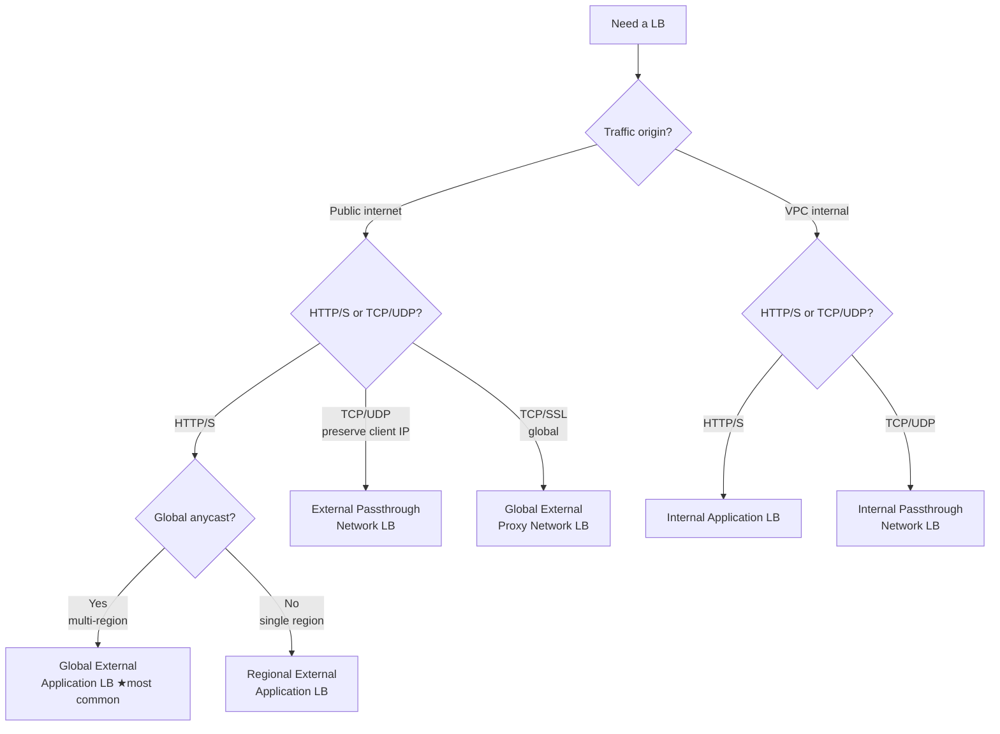

# VPC and Networking

GCP networking differs from AWS / Azure in a key way: **VPCs are global**; only subnets are bound to a region. This makes "one VPC across multiple regions" the default.

## 1. Hierarchy

```
VPC (global)
├── Subnet A (asia-east1, 10.10.0.0/20)
├── Subnet B (us-central1, 10.20.0.0/20)
├── Firewall rules (global)
├── Routes (global)
└── Connectors: Cloud NAT, VPN, Interconnect, PSC, Peering
```

Every project gets a default VPC named `default` with one subnet per region. **Don't use `default` for production** — create a clean VPC.

## 2. Create a VPC

```bash
# Custom mode: define your own subnets (most common)
gcloud compute networks create prod-vpc --subnet-mode=custom

gcloud compute networks subnets create prod-tw \
  --network=prod-vpc \
  --region=asia-east1 \
  --range=10.10.0.0/20 \
  --enable-private-ip-google-access \
  --enable-flow-logs

gcloud compute networks subnets create prod-us \
  --network=prod-vpc \
  --region=us-central1 \
  --range=10.20.0.0/20
```

| Flag | Purpose |
| --- | --- |
| `--enable-private-ip-google-access` | VMs without external IPs can still reach Google APIs (GCS, Pub/Sub, etc.) |
| `--enable-flow-logs` | VPC Flow Logs for debugging and auditing |

## 3. Firewall rules

GCP firewall is **stateful**, with **default deny ingress / default allow egress**.

```bash
# Allow IAP (Google's SSH bastion) to SSH into VMs tagged ssh-allowed
gcloud compute firewall-rules create allow-iap-ssh \
  --network=prod-vpc \
  --direction=INGRESS \
  --action=ALLOW \
  --rules=tcp:22 \
  --source-ranges=35.235.240.0/20 \
  --target-tags=ssh-allowed

# Allow internal traffic (within VPC IP ranges)
gcloud compute firewall-rules create allow-internal \
  --network=prod-vpc \
  --direction=INGRESS \
  --action=ALLOW \
  --rules=tcp,udp,icmp \
  --source-ranges=10.10.0.0/16,10.20.0.0/16
```

> **Use tags / service accounts as targets, not IPs.** When VMs change IP, rules don't need updating.

### Hierarchical Firewall Policy

Set top-priority rules at Org / Folder level that child projects can't override. E.g. "deny SSH from 0.0.0.0/0 anywhere". Common in security-team-managed orgs.

## 4. Cloud NAT (give VMs without external IPs internet access)

```bash
gcloud compute routers create prod-router \
  --network=prod-vpc --region=asia-east1

gcloud compute routers nats create prod-nat \
  --router=prod-router --region=asia-east1 \
  --nat-all-subnet-ip-ranges \
  --auto-allocate-nat-external-ips
```

- VMs **don't need external IPs** to `apt update` or call third-party APIs.
- All outbound traffic appears as the NAT IP — internal VMs are not exposed.
- **Required for GKE Autopilot / private clusters** — otherwise nodes can't reach the internet.

## 5. Private Google Access vs Private Service Connect

Easy to confuse, totally different:

| Mechanism | Purpose |
| --- | --- |
| **Private Google Access (PGA)** | VMs without external IPs reach Google APIs (GCS, BQ…) over Google's backbone. Subnet-level flag. |
| **Private Service Access (PSA)** | Reach Google-managed services (Cloud SQL Private IP, Memorystore) via VPC peering. |
| **Private Service Connect (PSC)** | Map Google services / 3rd-party SaaS / your own services into your VPC as an IP. Most modern, recommended. |

## 6. VPC Peering vs Shared VPC

| Mechanism | Purpose |
| --- | --- |
| **VPC Peering** | Connect two VPCs (possibly different projects / orgs). **Not transitive**: A↔B and B↔C does not imply A↔C. |
| **Shared VPC** | One host project owns the VPC; service projects use it. Centralized network management, distributed workloads. **Standard for larger orgs.** |

Shared VPC example:

```bash
# Host project
gcloud compute shared-vpc enable HOST_PROJECT
gcloud compute shared-vpc associated-projects add SERVICE_PROJECT --host-project=HOST_PROJECT
```

Then SERVICE_PROJECT's GKE / GCE can be created on subnets in HOST_PROJECT.

## 7. Load Balancing overview

GCP has many LB types — easy to pick the wrong one as a beginner:

| Name | Purpose | Layer | Scope |
| --- | --- | --- | --- |
| **Global External Application LB** | External HTTPS (websites, APIs) | L7 | Global |
| Regional External Application LB | Same but regional | L7 | Region |
| Global External Proxy Network LB | External TCP/SSL | L4 | Global |
| Internal Application LB | Internal HTTPS in VPC | L7 | Region |
| Internal Passthrough Network LB | Internal TCP/UDP, preserves client IP | L4 | Region |
| External Passthrough Network LB | External TCP/UDP (gaming, custom protocols) | L4 | Region |

> Most common: external website → **Global External Application LB**; internal microservices → **Internal Application LB**; GKE creates these automatically via `Service type=LoadBalancer` or Ingress.

### LB selection decision tree



## 8. VPN / Interconnect (connect to on-prem)

| Option | Best for | Speed | Cost |
| --- | --- | --- | --- |
| Cloud VPN (HA) | Modest traffic, fast setup | < 3 Gbps | Low |
| Partner Interconnect | 10G via ISP | 10G | Medium |
| Dedicated Interconnect | Direct fiber to Google | 10/100G | High |

## 9. Common debugging

```bash
# Check routes affecting a VPC
gcloud compute routes list --filter="network:prod-vpc"

# List firewall rules
gcloud compute firewall-rules list --filter="network:prod-vpc"

# Network Intelligence Center → Connectivity Tests (Console)
#   Enter source/destination, simulates packet path

# Query VPC Flow Logs in BigQuery
SELECT src_ip, dest_ip, COUNT(*) AS pkts
FROM `PROJECT.flow_logs.compute_googleapis_com_vpc_flows_*`
WHERE dest_port = 443
GROUP BY src_ip, dest_ip
ORDER BY pkts DESC LIMIT 20;
```

## 10. Common pitfalls

- **GKE node has no internet**: private cluster without Cloud NAT.
- **VM can't reach GCS / APIs**: subnet missing Private Google Access, or no external IP and no Cloud NAT.
- **Firewall rule has no effect**: priority matters (0 highest, default 1000); a higher-priority deny may be shadowing it. Use Connectivity Tests.
- **Cloud SQL Private IP unreachable**: missing Service Networking peering, or Pod CIDR not in authorized range for GKE.
- **VPC Peering doesn't transit**: A↔B and B↔C ≠ A↔C — peer directly.
- **Region misalignment**: app in asia-east1, DB in asia-east2 → cross-region egress fees + latency.
