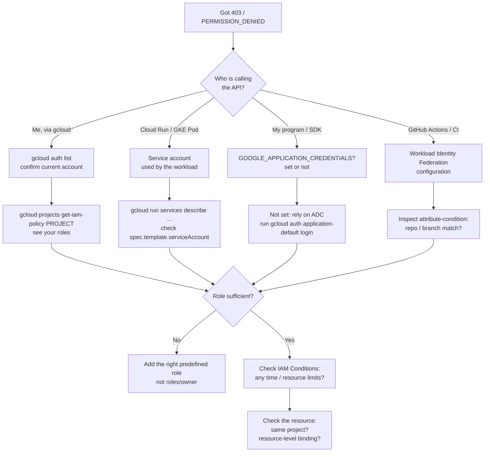
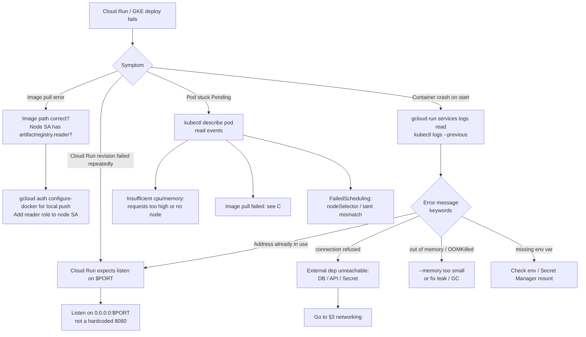
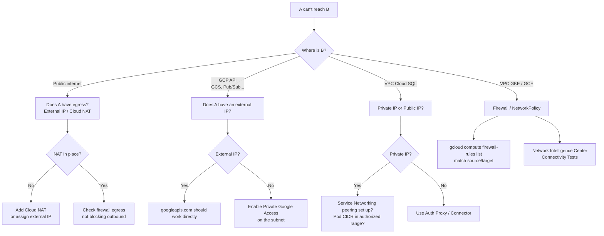
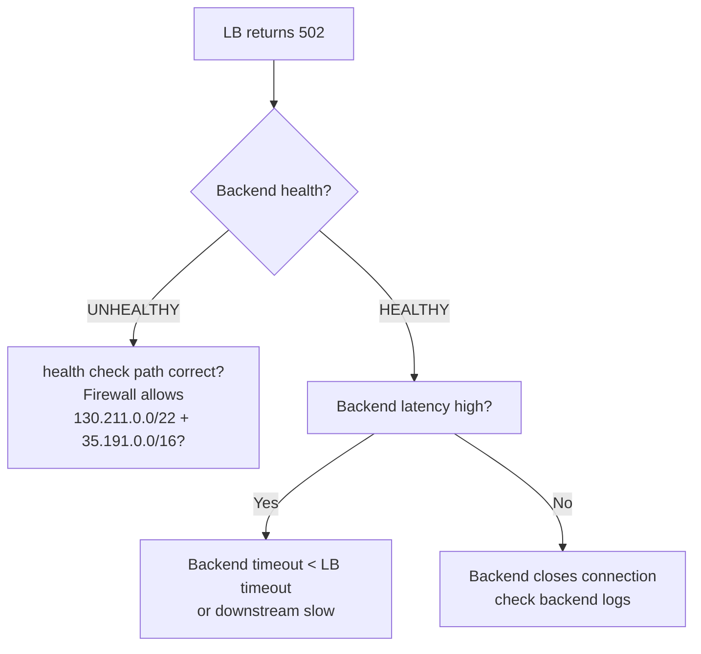
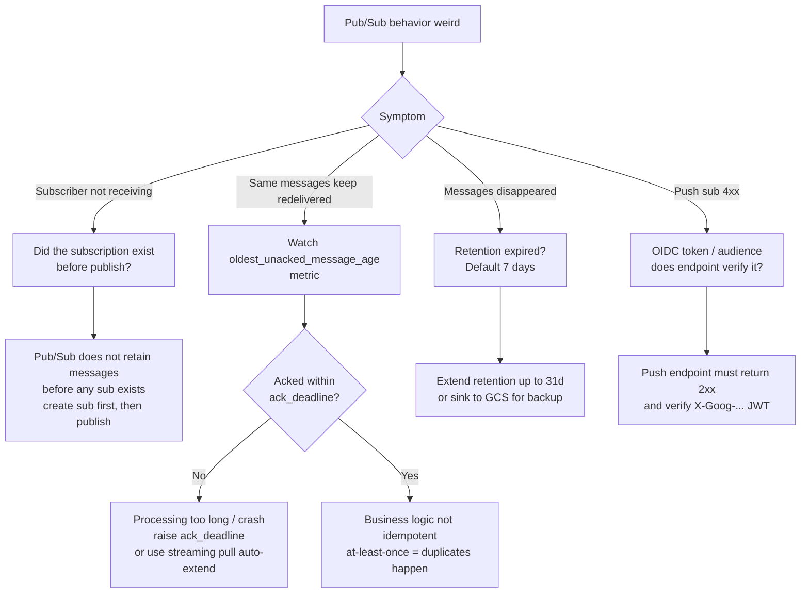
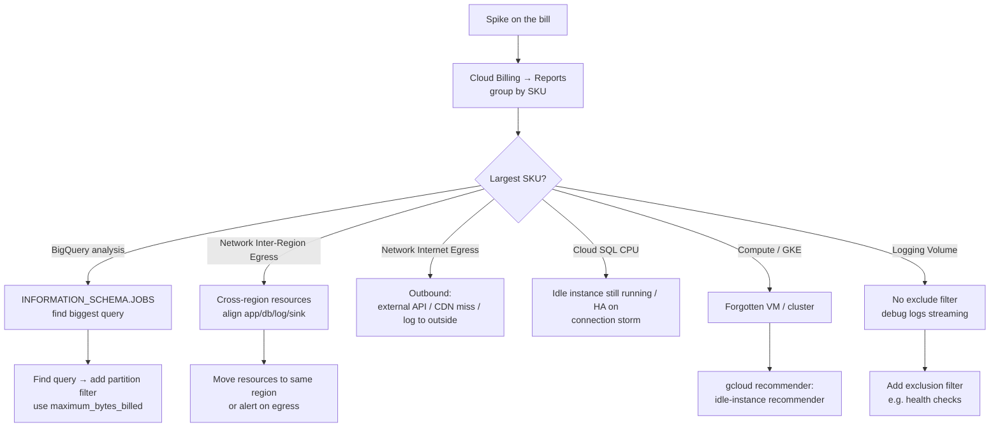
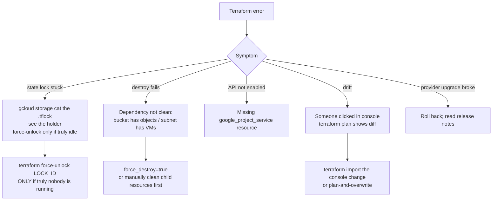

# Troubleshooting: decision flows for common issues

"Why is this broken" is a beginner's most painful moment. This file turns 80% of the "stuck" situations I've seen into decision trees.

> Step zero: **always read the full error message**. GCP errors are usually precise but get truncated in the console's small panel. Pull the full one from Cloud Logging (filter `severity>=ERROR` plus your service).

## 1. Auth / permissions: 401, 403, PERMISSION_DENIED

The number-one beginner pain. First disambiguate **who** is doing **what**.



### Quick reference: "I granted the role but still can't"

| Symptom | Cause |
| --- | --- |
| Just granted role, still 403 | IAM changes can take **up to 2 minutes** to propagate |
| Don't see your binding on the resource | It may live at project / folder / org level |
| Role is correct but service ignores it | The service may not support IAM Conditions, so adding one is equivalent to no grant |
| Cloud Run / Function 401 | Caller didn't send an ID token, or audience is wrong (must be the full service URL) |
| GKE Pod 403 | Workload Identity has 3 steps; you skipped one (cluster pool / GCP SA token / K8s SA annotation) |
| Service A → Service B 401 | A's SA needs `run.invoker` on B (not on A itself) |

## 2. Deploy fails / container won't start



## 3. Networking: can't reach, timeouts, 502



### Diagnosing 502 from a Load Balancer



## 4. Pub/Sub: messages missing or duplicated



## 5. Bill anomaly / sudden cost spike



## 6. Terraform horror stories



## 7. Universal first move: turn on Audit Logs

A lot of "why blocked" mysteries become obvious in Audit Logs:

```text
# Cloud Logging query
protoPayload.authorizationInfo.granted=false
resource.type="<service-type>"
```

If **Data Read / Data Write** events aren't showing up — they're off by default. Console → IAM → Audit Logs → enable.

## 8. Still stuck?

1. **Reproduce minimally**: use `curl` or a 5-line script to isolate from your own code.
2. **Check quotas**: many "can't create" errors are quota exhaustion. Console → IAM & Admin → Quotas.
3. **[Issue Tracker](https://issuetracker.google.com/)** for known issues.
4. **Official troubleshooting docs**: every service has one — e.g. [Cloud Run troubleshooting](https://cloud.google.com/run/docs/troubleshooting).
