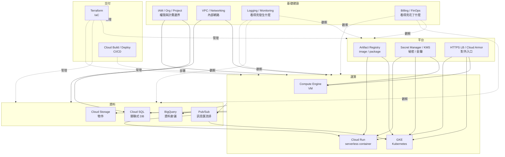
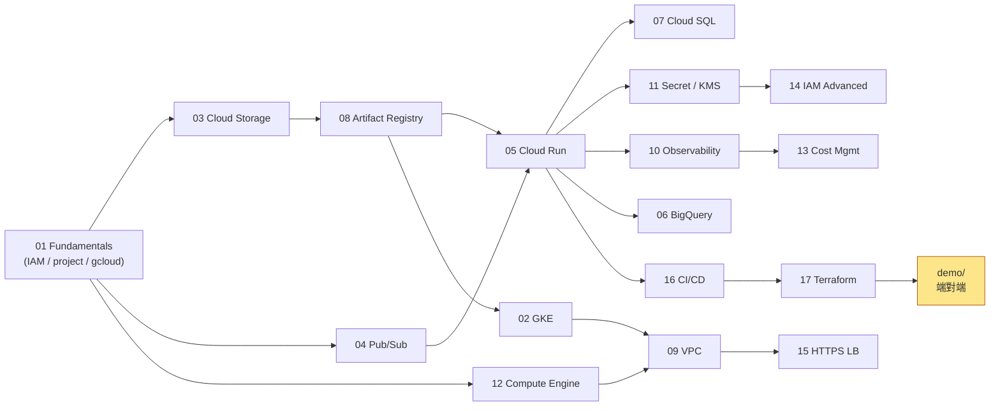
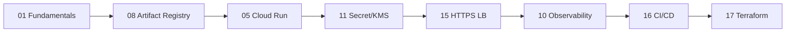
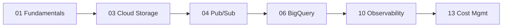
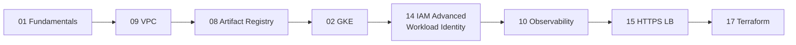

# 00 — 總覽：從哪裡開始

這份是給**第一次打開 GCP** 的讀者。用一張圖把所有主題的關係攤開，再給你一個讀完不混亂的順序。

## 1. GCP 服務地景（一張圖看懂）



**讀法**：底層（IAM、網路、觀測、計費）撐住一切；運算層（VM/K8s/Run）做事；資料層存東西；平台層管秘密與入口；交付層自動化。

## 2. 主題編號 ↔ 服務 ↔ 何時讀



> 編號是**建議順序**，不是嚴格依賴。需要時可以跳讀；但黃色的 demo 假設你看完前面 17 篇。

## 3. 三條學習路徑

依你的目標選一條，能省掉一半時間：

### 🚀 路徑 A：「我要把一個 web service 上 GCP」

最短可達生產：



跳過 GKE / GCE / Pub/Sub / BigQuery 也能上線。

### 📊 路徑 B：「我要做資料分析平台」



**13 Cost Mgmt 對 BQ 特別重要**——一個 SELECT * 可能要幾百美。

### ☸️ 路徑 C：「我已經會 K8s，想搬到 GKE」



## 4. 詞彙表（最容易混淆的）

| 詞 | 是什麼 | 常見誤解 |
| --- | --- | --- |
| **Project** | 計費 / IAM / API 的單位（每個 resource 屬於一個） | 跟 Folder / Org 搞混；Project ID（字串）跟 Project Number（數字）兩個都有 |
| **Service Account（SA）** | 給程式用的身份，是 IAM principal | 不是「服務的設定檔」；**SA email 與 K8s ServiceAccount 是兩回事** |
| **ADC** | Application Default Credentials | 不是某個檔案，是 SDK 的「找憑證順序」 |
| **Workload Identity** | 讓 GKE Pod / Cloud Run 自動拿 GCP 身份 | 不要跟 Workload Identity Federation（WIF，給外部用的）混 |
| **Region / Zone** | Region = 地理區（asia-east1）；Zone = region 內的 datacenter（asia-east1-a/b/c） | Cloud Storage bucket 也叫 location 但用 region 名 |
| **Tag vs Label** | Label = 純標籤（計費/搜尋）；Tag = 有 IAM 模型，可作 Org Policy 條件 | 兩個都叫 tag/label，會搞混 |
| **GCS Class A vs B operations** | A = 寫操作（PUT、LIST），B = 讀操作（GET） | A 比 B 貴 10 倍以上，大量小檔上傳會痛 |
| **VPC（GCP）** | **全域**物件，subnet 才綁 region | 跟 AWS 不一樣；可以一個 VPC 跨多 region |
| **Egress** | 出向流量 | 跨 region、出網際網路才貴；同 region 內部多半免費 |
| **CMEK / CSEK** | CMEK = 自管金鑰（KMS）；CSEK = 客戶提供金鑰 | CMEK 是 99% 場景；CSEK 幾乎不用 |

## 5. 前置知識

讀這份筆記**不需要**：GCP 經驗。

讀這份筆記**最好已經懂**：

- 基本 Linux / shell（會 `cd`、`curl`、environment variable）
- 基本網路（IP、DNS、TLS、HTTP status code）
- Docker 基本概念（image、container、Dockerfile）
- Git / GitHub 基本

完全不熟 K8s 也沒關係——讀 02-gke 時碰到 Pod / Deployment 不懂可以跳過實作部分。

## 6. 動手前先做這三件事

1. **建一個專用 GCP project**：不要用主帳號的舊 project，亂測會誤刪資源。
2. **設預算告警**：Console → Billing → Budgets。NT$300、NT$500、NT$1000 三段告警。
3. **裝 gcloud + 跑兩條登入**：
   ```bash
   gcloud auth login                       # 給 CLI 用
   gcloud auth application-default login   # 給 SDK / Terraform 用
   ```

之後從 [01-fundamentals](./01-fundamentals.md) 開始。

## 7. 卡住時去哪

- **指令錯誤 / 權限問題**：先看 [`troubleshooting.md`](./troubleshooting.md) 的決策樹。
- **觀念問題**：每篇底部都有「常見坑」，多半是新手會碰到的具體錯誤。
- **官方文件**：`https://cloud.google.com/<service>/docs`（例：`/run/docs`）。
- **搜尋技巧**：加上 `site:cloud.google.com` 過濾掉雜訊。
