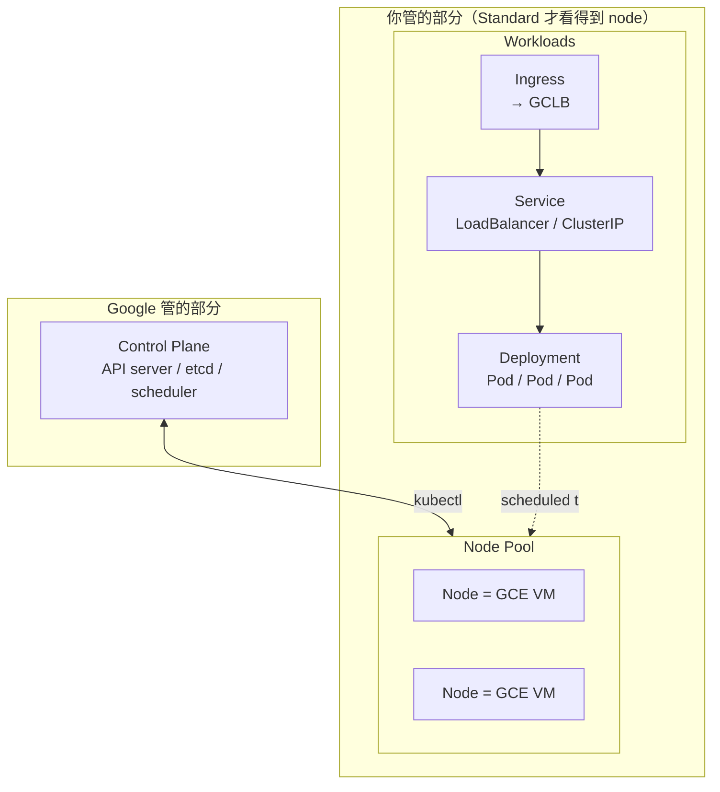
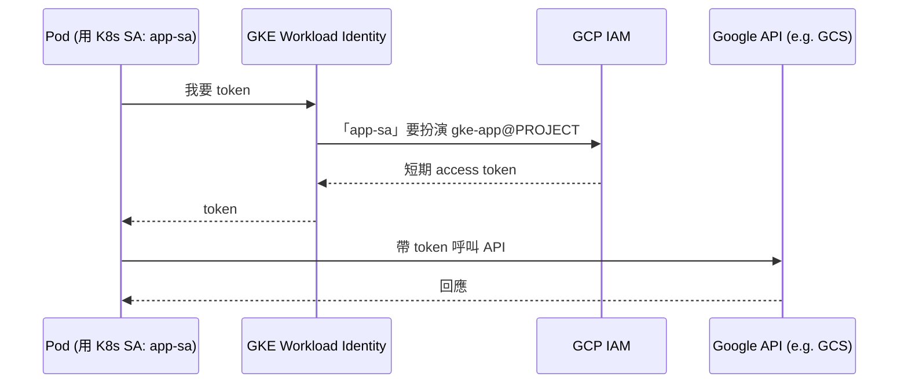

# GKE（Google Kubernetes Engine）

GKE 是 GCP 託管的 Kubernetes。它幫你扛掉 control plane（API server、etcd、scheduler）的維運，你只要關心 workload 與（在 Standard 模式下）node。



## 1. Standard vs Autopilot

| 項目 | Standard | Autopilot |
| --- | --- | --- |
| 你管理的範圍 | Node pool、機型、自動擴展 | 只管 Pod 規格 |
| 計費 | 依節點 VM 計費 | 依 Pod CPU/Mem/儲存計費 |
| 自由度 | 高（可裝 DaemonSet、自訂 OS、GPU 自選） | 限制較多（封閉的 system namespace、部分功能不開放） |
| 適合 | 需要客製、跑特殊 workload | 想要「serverless K8s」、不想管節點 |

新專案 / 不想碰節點 → **Autopilot**。要跑 GPU、特殊 DaemonSet、自訂 kernel → **Standard**。

## 2. 核心概念對應

| K8s 概念 | GKE 上的實際物 |
| --- | --- |
| Cluster | 一組 control plane + nodes（在某個 region/zone） |
| Node | Compute Engine VM（Standard 模式可見） |
| Pod | 容器的最小執行單位 |
| Service `LoadBalancer` | Google Cloud Load Balancer（外部 IP） |
| Ingress | 自動建立 GCLB（HTTP(S) LB） |
| PersistentVolume | Persistent Disk（pd-standard / pd-ssd / pd-balanced） |
| ServiceAccount + Workload Identity | 對應 GCP IAM SA |

## 3. 建立 Cluster

### Autopilot（推薦初學者）

```bash
gcloud container clusters create-auto demo-autopilot \
  --region=asia-east1 \
  --release-channel=regular
```

### Standard（zonal，便宜實驗用）

```bash
gcloud container clusters create demo-std \
  --zone=asia-east1-b \
  --num-nodes=2 \
  --machine-type=e2-small \
  --release-channel=regular \
  --enable-ip-alias
```

> `--enable-ip-alias` 啟用 VPC-native，是現在的預設與必要設定（讓 Pod IP 直接走 VPC）。

### 取得 kubeconfig

```bash
gcloud container clusters get-credentials demo-std --zone=asia-east1-b
kubectl get nodes
```

## 4. 部署一個簡單應用

`hello.yaml`：

```yaml
apiVersion: apps/v1
kind: Deployment
metadata:
  name: hello
spec:
  replicas: 2
  selector:
    matchLabels: { app: hello }
  template:
    metadata:
      labels: { app: hello }
    spec:
      containers:
      - name: hello
        image: gcr.io/google-samples/hello-app:2.0
        ports:
        - containerPort: 8080
        resources:
          requests: { cpu: "100m", memory: "128Mi" }
          limits:   { cpu: "500m", memory: "256Mi" }
---
apiVersion: v1
kind: Service
metadata:
  name: hello
spec:
  type: LoadBalancer        # GKE 會幫你開一個 GCLB + 外部 IP
  selector: { app: hello }
  ports:
  - port: 80
    targetPort: 8080
```

```bash
kubectl apply -f hello.yaml
kubectl get svc hello -w     # 等 EXTERNAL-IP 從 <pending> 變成 IP
curl http://EXTERNAL-IP
```

## 5. Workload Identity（重要）

讓 Pod 用 GCP IAM 身份（而不是塞 service account key 進 image）。**正式環境一定要用這個**。



三個必須做的綁定：(1) Cluster 開 workload-pool；(2) GCP SA 給 K8s SA `iam.workloadIdentityUser`；(3) K8s SA 加 annotation 指向 GCP SA。少一步都不會通。

```bash
# 1. 開 cluster 上的 Workload Identity（Autopilot 預設開啟）
gcloud container clusters update demo-std \
  --zone=asia-east1-b \
  --workload-pool=PROJECT_ID.svc.id.goog

# 2. 建 GCP Service Account 並給權限（例如讀 GCS）
gcloud iam service-accounts create gke-app
gcloud projects add-iam-policy-binding PROJECT_ID \
  --member="serviceAccount:gke-app@PROJECT_ID.iam.gserviceaccount.com" \
  --role="roles/storage.objectViewer"

# 3. 建 K8s ServiceAccount，並把它跟 GCP SA 綁起來
kubectl create serviceaccount app-sa
gcloud iam service-accounts add-iam-policy-binding \
  gke-app@PROJECT_ID.iam.gserviceaccount.com \
  --role="roles/iam.workloadIdentityUser" \
  --member="serviceAccount:PROJECT_ID.svc.id.goog[default/app-sa]"

kubectl annotate serviceaccount app-sa \
  iam.gke.io/gcp-service-account=gke-app@PROJECT_ID.iam.gserviceaccount.com
```

之後在 Pod spec 加上 `serviceAccountName: app-sa`，Pod 內呼叫 GCS / Pub/Sub 都會自動帶 IAM 身份。

## 6. 自動擴展三層

| 層級 | 擴展對象 | 工具 |
| --- | --- | --- |
| Pod 數量 | Deployment 副本數 | HPA（Horizontal Pod Autoscaler） |
| Pod 規格 | CPU/Mem requests | VPA（Vertical Pod Autoscaler） |
| Node 數量 | 節點 VM 數 | Cluster Autoscaler / Node Auto-Provisioning |

```bash
# HPA：CPU 超過 70% 就擴（最多 10 個 replica）
kubectl autoscale deployment hello --cpu-percent=70 --min=2 --max=10
```

## 7. 觀測

- **Cloud Logging**：Pod stdout/stderr 自動進去，用 `resource.type="k8s_container"` 過濾。
- **Cloud Monitoring**：Pod CPU/Mem、節點狀態自動採。
- **GKE Dashboard**：Console → Kubernetes Engine → Workloads，可以直接看 logs / events。

## 8. 清理（避免被收費）

```bash
gcloud container clusters delete demo-std --zone=asia-east1-b
```

> Autopilot cluster 有「最低費用」即使沒 workload；Standard cluster 即使把 node pool 縮到 0，每小時仍會收 control plane 費用。**做完實驗就刪**。

## 9. 常見坑

- **Pod 一直 Pending**：節點不夠 → 看 `kubectl describe pod` 的 events，多半是 `Insufficient cpu/memory`，要嘛加 node 要嘛調 requests。
- **Service `LoadBalancer` 一直 pending**：通常是專案配額、或忘了啟用 `compute.googleapis.com`。
- **Image pull error from Artifact Registry**：node 預設用的 SA 需要 `roles/artifactregistry.reader`。
- **Workload Identity 不生效**：忘了 annotate K8s SA、或 Pod 沒設 `serviceAccountName`。
