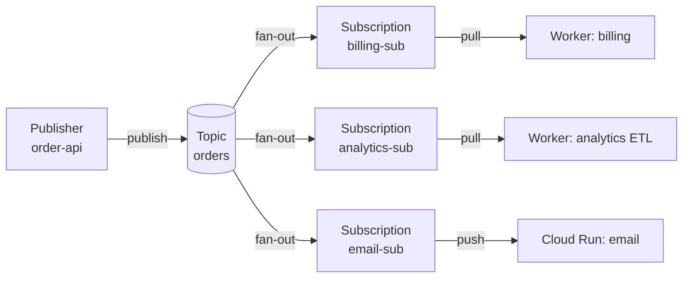

# Pub/Sub

GCP 的全託管訊息佇列 / 事件匯流排，類似 Kafka 但 serverless。重點特性：**至少一次（at-least-once）送達**、**全球可用**、**自動擴展到百萬 QPS**。

## 1. 核心概念



**重點**：每個 subscription 都會收到 topic 的**完整副本**（fan-out）。同一 subscription 的訊息會分配給多個 worker（load balancing）。

| 名詞 | 意義 |
| --- | --- |
| **Topic** | 訊息流的命名管道，publisher 寫入這裡。 |
| **Subscription** | 從 topic 取訊息的「實例」。每個 subscription 都會收到 topic 的**完整副本**。 |
| **Message** | `data`（bytes）+ `attributes`（小型 KV）+ `messageId` + `publishTime`。 |
| **Ack deadline** | Subscriber 拿到訊息後必須在這時間內 ack，否則 Pub/Sub 會重送。 |
| **Dead Letter Topic（DLT）** | 重試太多次的訊息會被丟到這裡，避免 poison message 卡死。 |

> **一個 topic 多個 subscription = fan-out**。例如 `orders` topic 上掛 `billing-sub`、`analytics-sub`，兩邊各自獨立消費同一份訊息流。

## 2. Push vs Pull

| 模式 | 適合 | 缺點 |
| --- | --- | --- |
| **Pull** | 自家 worker、批次處理、需要 backpressure | 需要長期執行的 client |
| **Push** | Cloud Run / Cloud Functions / 外部 HTTPS endpoint | 流量大時可能壓垮下游、需要驗證 |

Push 訊息會用 POST + JSON body 送到你的 endpoint，body 結構：

```json
{
  "message": {
    "data": "base64-encoded-payload",
    "attributes": { "key": "value" },
    "messageId": "...",
    "publishTime": "2026-05-05T08:00:00Z"
  },
  "subscription": "projects/PROJECT/subscriptions/SUB_NAME"
}
```

下游回傳 `2xx` 表示 ack；非 2xx 會重試。

## 3. 動手做

### 建立 topic 與 subscription

```bash
gcloud pubsub topics create orders

# Pull subscription（最常見）
gcloud pubsub subscriptions create orders-billing \
  --topic=orders \
  --ack-deadline=30 \
  --message-retention-duration=7d

# Push subscription（推到 Cloud Run）
gcloud pubsub subscriptions create orders-notify \
  --topic=orders \
  --push-endpoint=https://my-service-xxxxx.a.run.app/pubsub \
  --push-auth-service-account=pubsub-invoker@PROJECT.iam.gserviceaccount.com
```

### 加 Dead Letter Topic

```bash
gcloud pubsub topics create orders-dlt

gcloud pubsub subscriptions update orders-billing \
  --dead-letter-topic=orders-dlt \
  --max-delivery-attempts=5
```

> 別忘了給 Pub/Sub 自己的 SA 對 DLT 的 `pubsub.publisher` 權限，否則 DLT 寫不進去。

### 發 / 收訊息（CLI 練手用）

```bash
# 發
gcloud pubsub topics publish orders \
  --message='{"order_id":"A001","amount":120}' \
  --attribute="region=tw,priority=high"

# 拉一筆出來看（auto-ack）
gcloud pubsub subscriptions pull orders-billing --auto-ack --limit=5
```

## 4. 程式範例（Python）

```python
# pip install google-cloud-pubsub
from google.cloud import pubsub_v1
import json

PROJECT = "YOUR_PROJECT"

# ---- Publisher ----
publisher = pubsub_v1.PublisherClient()
topic_path = publisher.topic_path(PROJECT, "orders")

future = publisher.publish(
    topic_path,
    data=json.dumps({"order_id": "A001", "amount": 120}).encode("utf-8"),
    region="tw",                          # attributes
    priority="high",
)
print("messageId:", future.result(timeout=30))


# ---- Subscriber (Pull, streaming) ----
subscriber = pubsub_v1.SubscriberClient()
sub_path = subscriber.subscription_path(PROJECT, "orders-billing")

def handle(message):
    try:
        payload = json.loads(message.data)
        print("got order:", payload, "attrs:", dict(message.attributes))
        # ... 真正處理
        message.ack()
    except Exception as e:
        print("processing failed:", e)
        message.nack()                    # 立刻重送；或不 ack 讓 ack_deadline 過期

streaming = subscriber.subscribe(sub_path, callback=handle)
print("listening...")
try:
    streaming.result()                    # 阻塞
except KeyboardInterrupt:
    streaming.cancel()
```

> Streaming pull client 會自動延長 ack deadline（lease management），你不需要自己處理。

## 5. 訊息順序（Ordering）

Pub/Sub 預設**不保證順序**。如果一定要順序：

1. 建 topic 時開 `--message-ordering`
2. 發訊息時帶 `ordering_key`（例如用 `user_id`）
3. Subscription 也要 `--enable-message-ordering`

```bash
gcloud pubsub topics create user-events --message-ordering
```

注意：開了 ordering 後，同一 key 的訊息只能由「一個」subscriber 同時處理 → 吞吐會降低。

## 6. Schema（避免 producer/consumer 對不上）

可以用 Avro / Protobuf 註冊 schema，發訊息時 Pub/Sub 會驗證：

```bash
gcloud pubsub schemas create order-schema \
  --type=AVRO \
  --definition-file=order.avsc

gcloud pubsub topics create orders \
  --schema=order-schema \
  --message-encoding=JSON
```

之後發不符合 schema 的訊息會被拒絕，能在 producer 端就擋下「打錯欄位」這種 bug。

## 7. 與其他服務整合

| 場景 | 做法 |
| --- | --- |
| GCS 檔案上傳事件 | `gcloud storage buckets notifications create gs://BUCKET --topic=...`（直接 publish 到 Pub/Sub） |
| Cloud Run 接收事件 | Push subscription + OIDC 驗證 |
| GKE worker | Pull subscription + Workload Identity |
| BigQuery 入庫 | **Pub/Sub BigQuery subscription**（不需自寫 ETL） |
| 跨服務事件 | 統一 publish 到 topic，多個 subscription 各自消費 |

## 8. 清理

```bash
gcloud pubsub subscriptions delete orders-billing orders-notify
gcloud pubsub topics delete orders orders-dlt
```

## 9. 常見坑

- **重複訊息**：at-least-once 必然會發生。**Subscriber 要做 idempotent**（用 `messageId` 或業務 key 去重）。
- **訊息一直被重送**：通常是 subscriber 沒 ack（程式 crash、處理超過 ack deadline）。看 `Cloud Monitoring → subscription/oldest_unacked_message_age`。
- **Push subscription 4xx**：endpoint 沒驗證 / 沒回 200。push 模式建議搭 OIDC token 驗證。
- **Topic 沒人訂閱會丟訊息**：發訊息**時刻**沒有 subscription 存在的話，這些訊息不會留下來。先建 subscription 再開始發。
- **訊息延遲過久**：訊息保留期預設 7 天、最長 31 天。超過就會被丟掉。
- **大訊息**：單筆上限 10MB，但便宜的是「丟到 GCS、訊息只放 GCS path」。
