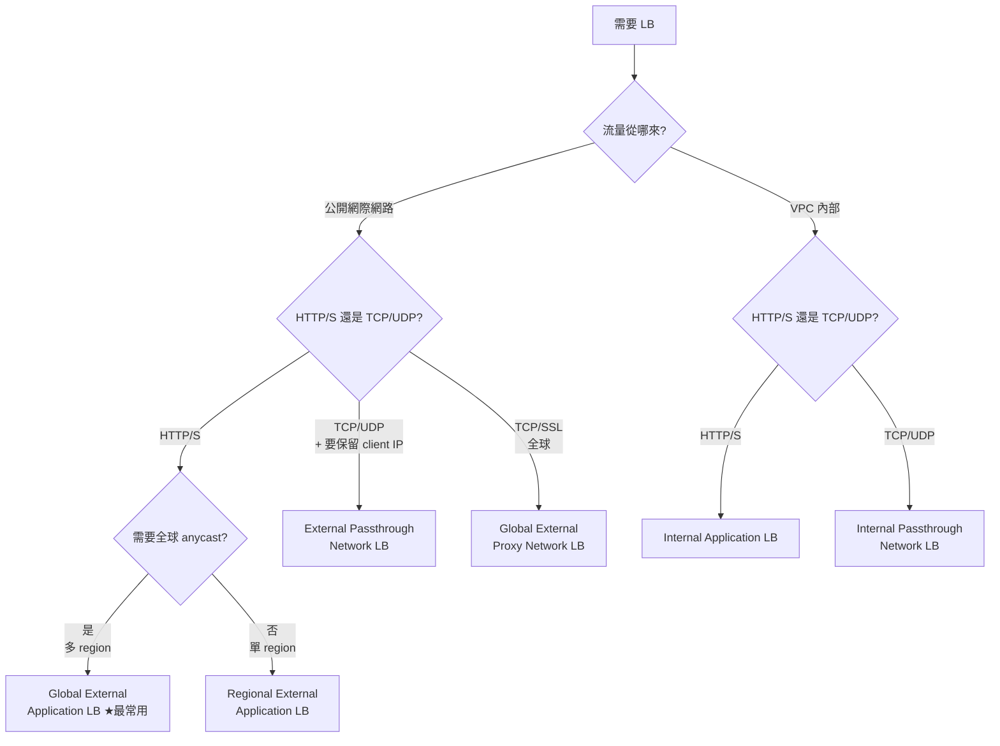

# VPC 與 Networking

GCP 的網路跟 AWS / Azure 不一樣的關鍵點：**VPC 是全域（global）的**，subnet 才綁 region。這讓「一個 VPC 跨多 region」變成預設選項。

## 1. 階層

```
VPC (global)
├── Subnet A (asia-east1, 10.10.0.0/20)
├── Subnet B (us-central1, 10.20.0.0/20)
├── Firewall rules (global)
├── Routes (global)
└── 各種 connector：Cloud NAT, VPN, Interconnect, PSC, Peering
```

每個 GCP 專案預設會有一個叫 `default` 的 VPC，每個 region 一個 subnet。**正式環境不要用 default**——自己建乾淨的 VPC。

## 2. 建一個 VPC

```bash
# Custom mode：subnet 自己定，最常用
gcloud compute networks create prod-vpc --subnet-mode=custom

gcloud compute networks subnets create prod-tw \
  --network=prod-vpc \
  --region=asia-east1 \
  --range=10.10.0.0/20 \
  --enable-private-ip-google-access \
  --enable-flow-logs

gcloud compute networks subnets create prod-us \
  --network=prod-vpc \
  --region=us-central1 \
  --range=10.20.0.0/20
```

| Flag | 用途 |
| --- | --- |
| `--enable-private-ip-google-access` | 沒外部 IP 的 VM 也能呼叫 Google API（GCS、Pub/Sub 等） |
| `--enable-flow-logs` | VPC Flow Logs，除錯與審計用 |

## 3. Firewall rules

GCP firewall 是 **stateful**、**default deny ingress / default allow egress**。

```bash
# 允許 IAP（Google 的 SSH bastion）SSH 到帶 ssh-allowed tag 的 VM
gcloud compute firewall-rules create allow-iap-ssh \
  --network=prod-vpc \
  --direction=INGRESS \
  --action=ALLOW \
  --rules=tcp:22 \
  --source-ranges=35.235.240.0/20 \
  --target-tags=ssh-allowed

# 允許內部互通（同 VPC 內部 IP 範圍）
gcloud compute firewall-rules create allow-internal \
  --network=prod-vpc \
  --direction=INGRESS \
  --action=ALLOW \
  --rules=tcp,udp,icmp \
  --source-ranges=10.10.0.0/16,10.20.0.0/16
```

> **用 tags / service accounts 當 target，不要用 IP**。VM 換 IP 沒事，rule 不用改。

### Hierarchical Firewall Policy

可以在 Org / Folder 層級設「最高優先」的規則，子專案無法覆蓋。例如：「禁止任何 0.0.0.0/0 進 SSH」。安全團隊在用。

## 4. Cloud NAT（給沒有外部 IP 的 VM 出網際網路）

```bash
gcloud compute routers create prod-router \
  --network=prod-vpc --region=asia-east1

gcloud compute routers nats create prod-nat \
  --router=prod-router --region=asia-east1 \
  --nat-all-subnet-ip-ranges \
  --auto-allocate-nat-external-ips
```

- VM **不需要外部 IP** 就能 `apt update` / 呼叫第三方 API。
- 來源 IP 都是 NAT 的 IP，外部看不到內部 VM。
- **GKE Autopilot / private cluster 必設**，否則 node 連不到網路。

## 5. Private Google Access vs Private Service Connect

兩個容易混淆但完全不同：

| 機制 | 用途 |
| --- | --- |
| **Private Google Access (PGA)** | 沒外部 IP 的 VM 走 Google 內部 backbone 呼叫 Google API（GCS、BQ…）。subnet 上的 flag。 |
| **Private Service Access (PSA)** | 透過 VPC peering 連到 Google 提供的服務（Cloud SQL Private IP、Memorystore）。 |
| **Private Service Connect (PSC)** | 把 Google 服務 / 第三方 SaaS / 自家服務「映射」成你 VPC 內的一個 IP。最現代化、推薦。 |

## 6. VPC Peering vs Shared VPC

| 機制 | 用途 |
| --- | --- |
| **VPC Peering** | 把兩個 VPC（可能不同 project / 不同 org）的網路打通。**不可遞移**：A↔B↔C 不代表 A↔C。 |
| **Shared VPC** | 一個 host project 開 VPC，其他 service projects 共用。集中管網路，分散部署 workload。**大公司標準做法**。 |

Shared VPC 範例：

```bash
# Host project
gcloud compute shared-vpc enable HOST_PROJECT
gcloud compute shared-vpc associated-projects add SERVICE_PROJECT --host-project=HOST_PROJECT
```

之後 SERVICE_PROJECT 的 GKE / GCE 可以建在 HOST_PROJECT 的 subnet 上。

## 7. Load Balancing 概覽

GCP 有多種 LB，新手最容易選錯：

| 名稱 | 用途 | 層 | 範圍 |
| --- | --- | --- | --- |
| **Global External Application LB** | 對外 HTTPS（網站、API） | L7 | Global |
| Regional External Application LB | 同上但 regional | L7 | Region |
| Global External Proxy Network LB | TCP/SSL 對外 | L4 | Global |
| Internal Application LB | VPC 內 HTTPS | L7 | Region |
| Internal Passthrough Network LB | VPC 內 TCP/UDP，保留 client IP | L4 | Region |
| External Passthrough Network LB | 對外 TCP/UDP（遊戲、自家 protocol） | L4 | Region |

> 大多數情況：對外網站 → **Global External Application LB**；內部微服務 → **Internal Application LB**；GKE 用 `Service type=LoadBalancer` 或 Ingress 會自動建。

### LB 選擇決策樹



## 8. VPN / Interconnect（連到地端）

| 選項 | 適合 | 速度 | 成本 |
| --- | --- | --- | --- |
| Cloud VPN (HA) | 中小流量、快速 setup | < 3 Gbps | 低 |
| Partner Interconnect | 透過 ISP，10G | 10G | 中 |
| Dedicated Interconnect | 直接連到 Google | 10/100G | 高 |

## 9. 常用除錯

```bash
# 檢查路由：從 VM 看某 IP 走哪條
gcloud compute routes list --filter="network:prod-vpc"

# Firewall 命中分析
gcloud compute firewall-rules list --filter="network:prod-vpc"

# Network Intelligence Center → Connectivity Tests（Console）
#   給來源/目的，自動模擬 packet 看會被誰擋

# VPC Flow Logs 在 BigQuery 查
SELECT src_ip, dest_ip, COUNT(*) AS pkts
FROM `PROJECT.flow_logs.compute_googleapis_com_vpc_flows_*`
WHERE dest_port = 443
GROUP BY src_ip, dest_ip
ORDER BY pkts DESC LIMIT 20;
```

## 10. 常見坑

- **GKE node 連不到網路**：private cluster 沒設 Cloud NAT。
- **VM 連不到 GCS / API**：subnet 沒開 Private Google Access、或沒外部 IP 又沒 Cloud NAT。
- **Firewall rule 不生效**：rule 有 priority，0 最高、預設 1000；可能被更高 priority 的 deny rule 蓋掉。用 Connectivity Tests 看。
- **Cloud SQL Private IP 連不到**：忘了 Service Networking peering、或 GKE Pod 在 Pod CIDR 沒被加進 authorized range。
- **VPC Peering 不會傳遞**：A↔B 與 B↔C 不代表 A↔C，要直接 peer。
- **Region 不對齊**：app 在 asia-east1、db 在 asia-east2 → 跨 region 流量費 + latency 雙倍痛。
