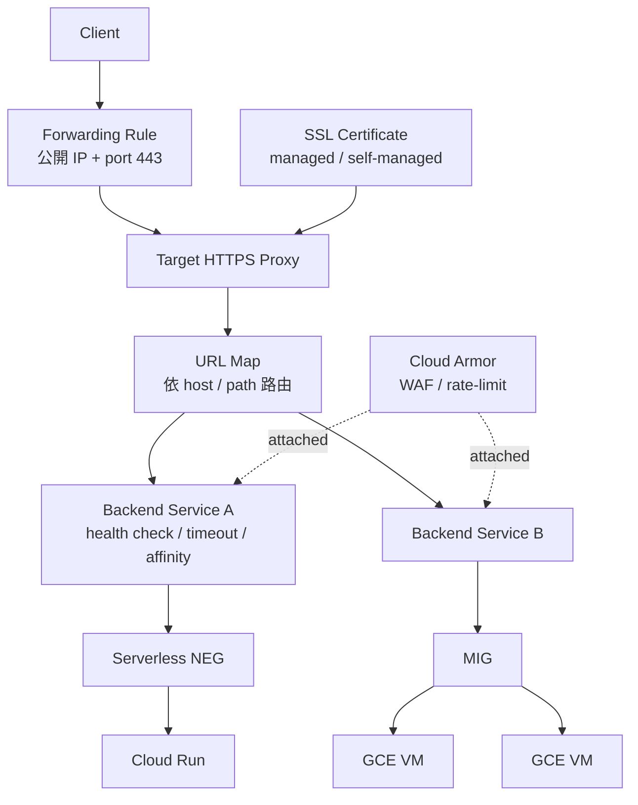

# HTTPS Load Balancer（深入版）

09-vpc-networking 列了 LB 種類；這篇深入講最常用的 **Global External Application Load Balancer**（HTTPS LB）：怎麼組起來、怎麼上 TLS、怎麼加 WAF / IAP。

## 1. 解剖



5 層物件，每一層獨立可改。第一次接手會頭暈，但拆開後每層做的事很單純。

## 2. Backend 種類

| 種類 | 適合 |
| --- | --- |
| **MIG**（Managed Instance Group） | 一群 GCE VM |
| **Zonal NEG** | 一組明確的 IP:port |
| **Serverless NEG** | Cloud Run / Cloud Functions / App Engine |
| **Internet NEG** | 自家 endpoint 或外部 service（給 GCLB 當前置） |
| **Hybrid NEG** | 地端 VM（透過 VPN/Interconnect） |
| **Backend Bucket** | GCS bucket（靜態網站） |
| **PSC NEG** | Private Service Connect endpoint |

## 3. 一個完整範例：Cloud Run + 自訂 domain + WAF

目標：讓 `https://api.example.com` 走 GCLB → Cloud Armor → Cloud Run。

### 3.1 準備

```bash
PROJECT=my-project
REGION=asia-east1
SERVICE=hello                       # 已存在的 Cloud Run service
DOMAIN=api.example.com
```

### 3.2 建 Serverless NEG

```bash
gcloud compute network-endpoint-groups create hello-neg \
  --region=$REGION \
  --network-endpoint-type=serverless \
  --cloud-run-service=$SERVICE
```

### 3.3 Backend service

```bash
gcloud compute backend-services create hello-bs \
  --global \
  --load-balancing-scheme=EXTERNAL_MANAGED \
  --protocol=HTTPS

gcloud compute backend-services add-backend hello-bs \
  --global \
  --network-endpoint-group=hello-neg \
  --network-endpoint-group-region=$REGION
```

> Serverless NEG **不需要** health check。

### 3.4 URL Map

```bash
gcloud compute url-maps create hello-urlmap \
  --default-service=hello-bs

# 進階：依 path 路由到不同 backend
# gcloud compute url-maps add-path-matcher ...
```

### 3.5 Managed SSL cert + Target Proxy

```bash
gcloud compute ssl-certificates create hello-cert \
  --global \
  --domains=$DOMAIN

gcloud compute target-https-proxies create hello-proxy \
  --url-map=hello-urlmap \
  --ssl-certificates=hello-cert
```

### 3.6 Forwarding Rule（公開 IP）

```bash
# 申請固定 IP
gcloud compute addresses create hello-ip --global

IP=$(gcloud compute addresses describe hello-ip --global --format="value(address)")
echo "把 $DOMAIN 的 A 記錄指向 $IP"

# 接上去
gcloud compute forwarding-rules create hello-fr \
  --global \
  --target-https-proxy=hello-proxy \
  --ports=443 \
  --address=hello-ip
```

DNS 改好後，Google 會自動驗證 + 發放 SSL（**ACME-style，要等 10–60 分鐘**）。

```bash
gcloud compute ssl-certificates describe hello-cert --global \
  --format="value(managed.status,managed.domainStatus)"
# ACTIVE; DOMAIN: api.example.com=ACTIVE  ← 等到看到這個才算成功
```

### 3.7 加 HTTP → HTTPS 轉址

```bash
# 另一條 HTTP forwarding rule，URL map 直接 redirect
gcloud compute url-maps create hello-redirect \
  --default-url-redirect-redirect-response-code=MOVED_PERMANENTLY_DEFAULT \
  --default-url-redirect-https-redirect

gcloud compute target-http-proxies create hello-http-proxy \
  --url-map=hello-redirect

gcloud compute forwarding-rules create hello-fr-http \
  --global --target-http-proxy=hello-http-proxy \
  --ports=80 --address=hello-ip
```

## 4. Cloud Armor（WAF）

```bash
gcloud compute security-policies create hello-armor \
  --description="WAF for hello"

# 擋掉某些國家
gcloud compute security-policies rules create 1000 \
  --security-policy=hello-armor \
  --src-region-codes=CN,RU \
  --action=deny-403

# 套用 OWASP 預設規則（XSS、SQLi）
gcloud compute security-policies rules create 2000 \
  --security-policy=hello-armor \
  --expression="evaluatePreconfiguredExpr('xss-v33-stable')" \
  --action=deny-403

# 速率限制：每 IP 60 秒最多 100 次
gcloud compute security-policies rules create 3000 \
  --security-policy=hello-armor \
  --src-ip-ranges='*' \
  --action=rate-based-ban \
  --rate-limit-threshold-count=100 \
  --rate-limit-threshold-interval-sec=60 \
  --conform-action=allow \
  --exceed-action=deny-429 \
  --enforce-on-key=IP \
  --ban-duration-sec=600

# 套到 backend service
gcloud compute backend-services update hello-bs --global \
  --security-policy=hello-armor
```

## 5. IAP（Identity-Aware Proxy）

加在 LB 前面，把「**只准登入 Google 的特定使用者進**」變成一行 config——後端不用自己做 auth。

```bash
# 啟用 IAP 在 backend service
gcloud compute backend-services update hello-bs --global \
  --iap=enabled,oauth2-client-id=CLIENT_ID,oauth2-client-secret=CLIENT_SECRET

# 把使用者加進白名單
gcloud iap web add-iam-policy-binding \
  --resource-type=backend-services \
  --service=hello-bs \
  --member=user:alice@example.com \
  --role=roles/iap.httpsResourceAccessor
```

> 後端要驗 IAP 簽章（看 header `X-Goog-Iap-Jwt-Assertion`），確保不是有人繞過 LB 直接打。

## 6. 觀測

| 指標 | 看什麼 |
| --- | --- |
| `loadbalancing.googleapis.com/https/request_count` | 流量 |
| 同 metric + label `response_code_class` | 5xx 比例 |
| `https/backend_latencies` | 後端延遲分布 |
| `https/total_latencies` | 端到端延遲（含 LB） |

LB 的 access logs 預設**不開**，要在 backend service 上開：

```bash
gcloud compute backend-services update hello-bs --global \
  --enable-logging --logging-sample-rate=1.0
```

## 7. 清理

```bash
gcloud compute forwarding-rules delete hello-fr hello-fr-http --global
gcloud compute target-https-proxies delete hello-proxy
gcloud compute target-http-proxies delete hello-http-proxy
gcloud compute url-maps delete hello-urlmap hello-redirect
gcloud compute backend-services delete hello-bs --global
gcloud compute network-endpoint-groups delete hello-neg --region=$REGION
gcloud compute ssl-certificates delete hello-cert --global
gcloud compute addresses delete hello-ip --global
```

> 這就是「為什麼大家都用 Terraform 管 LB」——9 個物件刪錯順序就會擋住。

## 8. 常見坑

- **SSL cert 一直 PROVISIONING**：DNS A 記錄沒指對 / TTL 太長 / domain 還沒 propagate。`dig $DOMAIN` 確認指到 LB IP。
- **502 從 LB**：後端 health check 不通、後端 timeout 比 LB timeout 短、後端回 connection close。先看 `backend_latencies` 與 backend logs。
- **客戶 IP 看到 LB 的 IP**：Application LB 是 proxy，client IP 在 `X-Forwarded-For` 第一欄。要保留真實 IP 用 Passthrough Network LB。
- **跨 region 流量超貴**：用 Global External Application LB **就會** 把流量丟到最近 region；確認 backend 也跨 region 部署。
- **WAF 把自己人擋了**：Cloud Armor 預設模式 `production` 會擋；用 `preview` 模式跑幾天看 logs 再切 production。
- **Forwarding rule 必須 EXTERNAL_MANAGED**：舊的 `EXTERNAL` 是 Classic LB，新功能（advanced traffic management）只在 EXTERNAL_MANAGED 上有。
