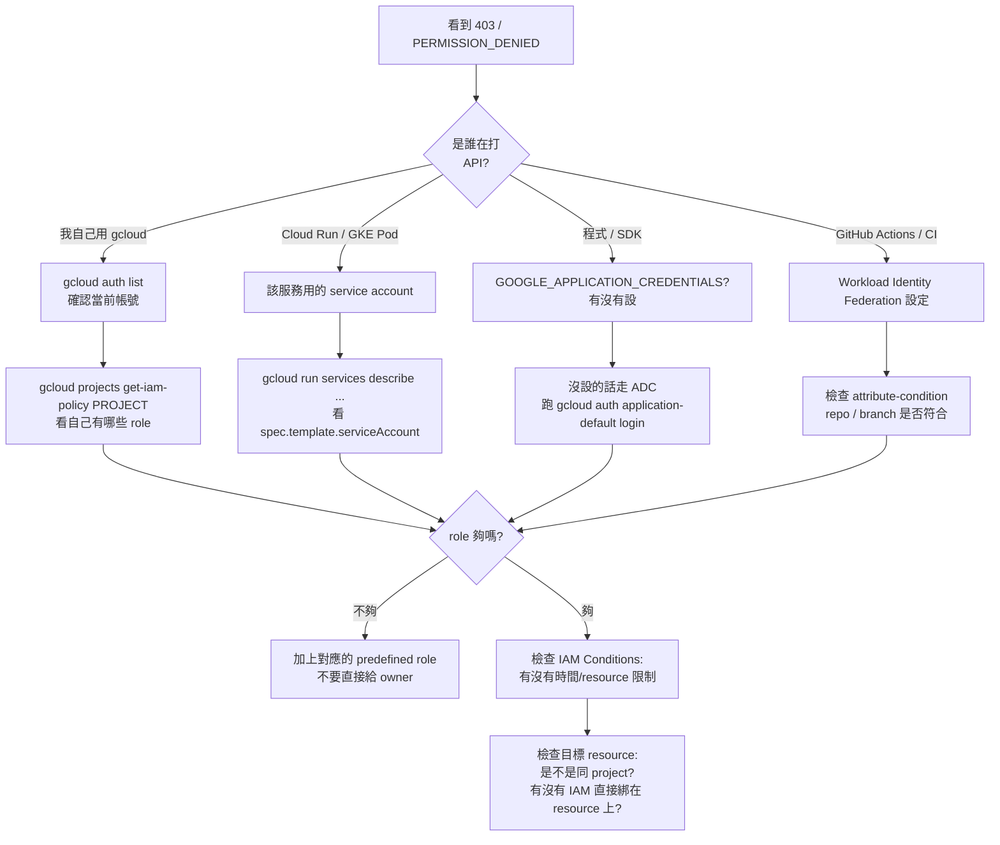
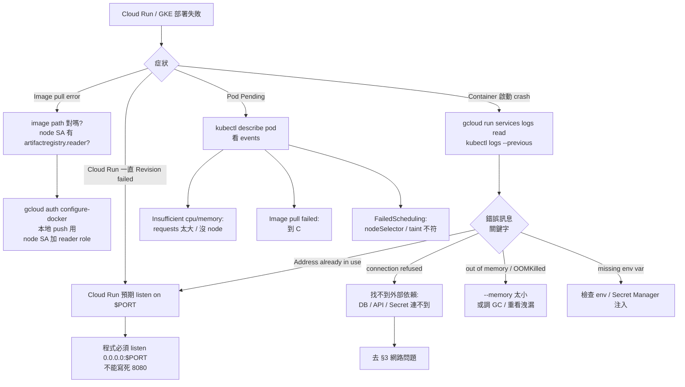
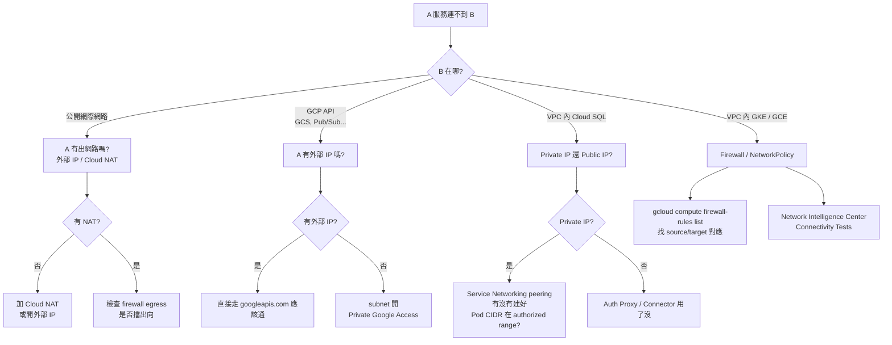
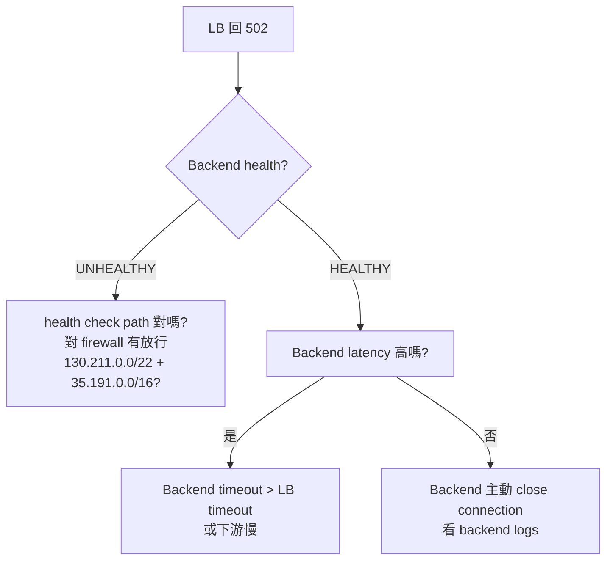
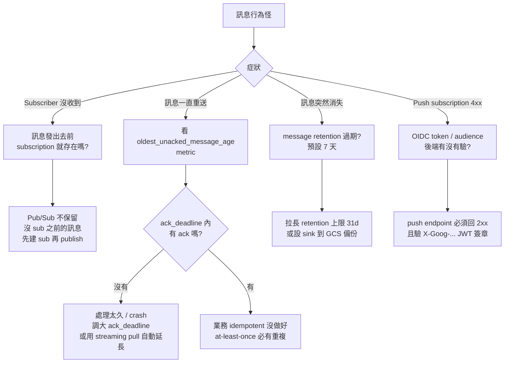
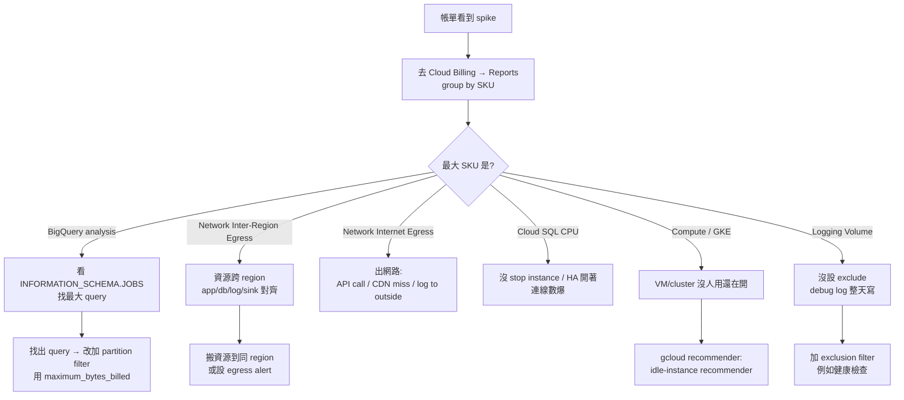
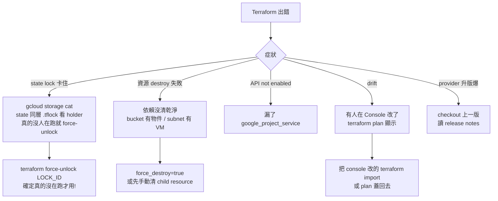

# Troubleshooting：常見問題的決策流程

「為什麼壞了」是新手最痛的時刻。這篇把我見過 80% 的「卡住」狀況做成決策樹。

> 第一步：永遠先看錯誤訊息全文。GCP 的錯誤訊息**通常很精準**，但會被截斷在 console 的小視窗裡。從 Cloud Logging 撈完整的（搜 `severity>=ERROR` + 你的 service）。

## 1. 認證 / 權限：401、403、PERMISSION_DENIED

新手最常碰到的問題。先分清楚 **誰** 在做 **什麼** 操作。



### 速查：「我給了 role 還是不通」常見原因

| 症狀 | 原因 |
| --- | --- |
| 剛給 role 立刻打就不通 | IAM 變更最多需 **2 分鐘** propagate |
| 在 resource 上看不到自己的 binding | binding 可能在 project / folder / org 任一層 |
| Role 對但服務不懂 | 該 service 沒支援 IAM Conditions，但你加了 condition 等於沒給 |
| Cloud Run / Function 401 | caller 沒帶 ID token，或 audience 寫錯（要是完整 service URL） |
| GKE Pod 403 | Workload Identity 三步驟有一步漏：cluster pool / GCP SA 給 token / K8s SA 加 annotation |
| Service A 呼 Service B 401 | A 的 SA 要有 B 的 `run.invoker`（不是 A 自己的權限） |

## 2. 部署失敗 / 容器起不來



## 3. 網路：連不到、timeout、502



### LB 收到 502 的判斷



## 4. 訊息收不到 / 重複處理（Pub/Sub）



## 5. 帳單異常 / 突然變貴



## 6. Terraform 鬼故事



## 7. 萬用第一招：開 Audit Logs

很多「為什麼會被擋」的問題在 Audit Logs 看得一清二楚：

```text
# Cloud Logging 查詢
protoPayload.authorizationInfo.granted=false
resource.type="<service-type>"
```

如果出現的是「**Data Read** / Data Write 找不到 log」——那是預設關閉的，先到 IAM → Audit Logs 開啟。

## 8. 還是搞不定？

1. **重現最小範例**：用 curl / 一行程式重現問題，去掉自家程式雜訊。
2. **檢查 quota**：很多「為什麼建不了」是 project quota 用完。Console → IAM & Admin → Quotas。
3. **去 [Issue Tracker](https://issuetracker.google.com/)** 看是不是 known issue。
4. **官方 docs 的 troubleshooting 區**：每個服務都有，例如 [Cloud Run troubleshooting](https://cloud.google.com/run/docs/troubleshooting)。
