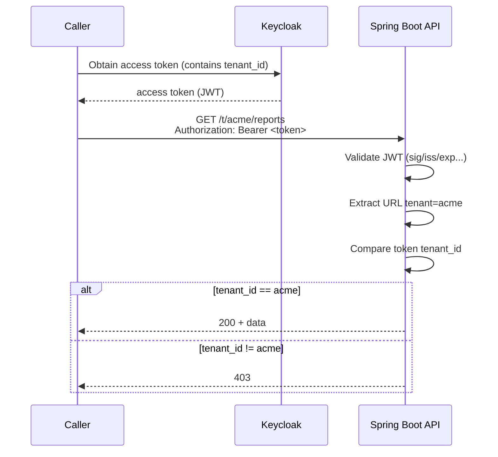

# 02 - Multi-tenancy (URL path, single realm)

Goal: standardize your API URL format and enforce a strict rule: the token claim `tenant_id` must match `{tenant}` in the URL path.

## URL convention

All tenant-isolated APIs use:

- `/t/{tenant}/...`

Examples:

- `GET /t/acme/reports`
- `POST /t/acme/reports`

## Token vs URL consistency rule (mandatory)

Your API must enforce all of the following:

1. Feature authorization (scope/role)
2. `tenant_id` claim must exist
3. URL `{tenant}` must equal token `tenant_id`

This prevents cross-tenant data access by URL tampering.

## Diagram: what happens during an API request

## Modeling tenants in Keycloak (recommended)

We use both Groups and a User attribute:

- Groups help manual admin operations.
- User attribute feeds the access token claim.

### Group hierarchy (manual)

- `/tenants`
  - `/tenants/acme`
  - `/tenants/umbrella`

Add users into the proper tenant group.

### User attribute (for claim)

For each user:

- key: `tenantId`
- value: `acme`

Next chapter maps it to the access token claim `tenant_id`.

## Checklist

- Do you allow users in multiple tenants? (This tutorial starts with single-tenant users.)
- Where do you enforce tenant matching in the API? (We do it in the Spring Boot section.)
