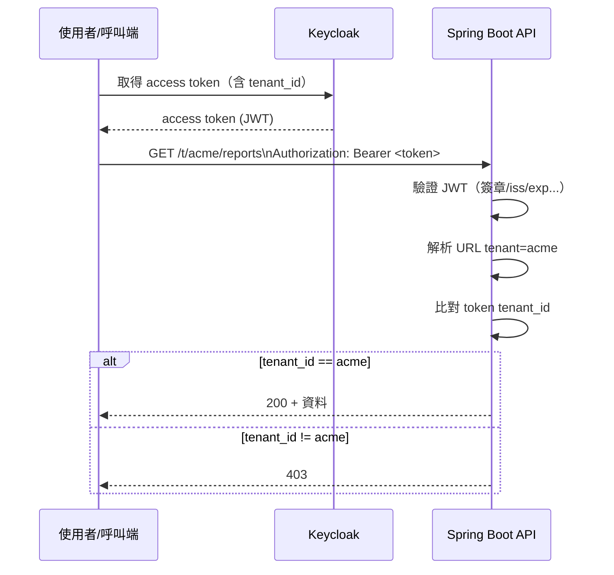

# 02 - 多租戶（URL path，單 Realm）

目標：定義你的 API URL 格式，並設計「token claim 的 `tenant_id` 必須等於 URL path 的 `{tenant}`」的安全規則。

## URL 約定

所有需要租戶隔離的 API 一律使用：

- `/t/{tenant}/...`

範例：

- `GET /t/acme/reports`
- `POST /t/acme/reports`

## Token 與 URL 的一致性規則（必做）

你的 API 必須同時滿足：

1. 使用者必須有功能面權限（scope/role）
2. `tenant_id` claim 必須存在
3. URL path 的 `{tenant}` 必須等於 token claim 的 `tenant_id`

這能避免：

- 使用者拿到合法 token，卻改 URL 讀取其他租戶資料（跨租戶越權）

## 流程圖：一次 API 呼叫會發生什麼事

## Keycloak 內的多租戶表示法（建議）

> 我們同時用「Group」與「User attribute」：Group 給你管理與檢視方便，attribute 用來產生 token claim。

### Group 結構（手動建立）

建議建立：

- `/tenants`
  - `/tenants/acme`
  - `/tenants/umbrella`

並把使用者加入對應租戶 group。

### User attribute（用來產生 claim）

每個使用者建立 attribute：

- key: `tenantId`
- value: `acme`（或對應租戶代碼）

下一章會把它映射到 access token claim：`tenant_id`。

## 檢核點

完成後你應該能回答：

- 一個使用者是否允許同時屬於多個租戶？（本教學先用單租戶，後續可擴充）
- 你的 API 在哪個 middleware/filter 做 tenant 比對？（我們在 Spring Boot 章節做）
