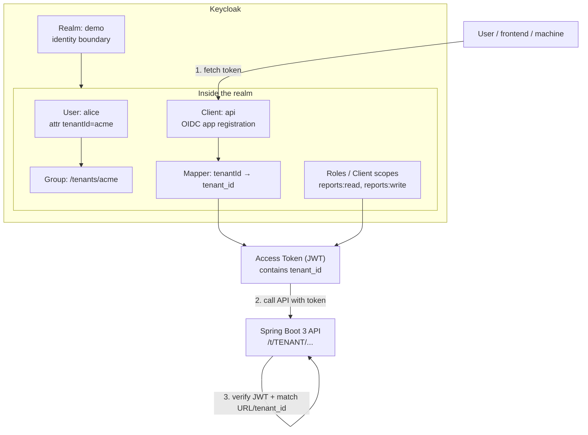
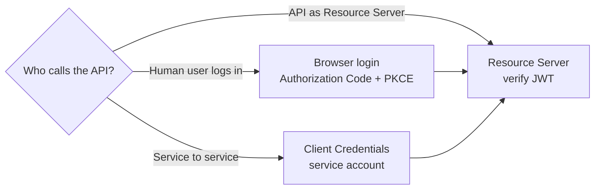

# 00 — Overview: Where to start

For your first time with Keycloak: one diagram for the core objects, decide which path you're on, learn the vocabulary that confuses everyone.

## 1. Keycloak in one picture

**Six core terms**: Realm (isolation boundary) → User (can carry attributes) → Client (app registration) → Mapper (puts attribute / role into token) → Token (JWT) → Resource Server (API verifies token).

## 2. Three usage paths

| Path | What you'll do |
| --- | --- |
| **Resource Server** (this tutorial's focus) | Spring Boot 3 verifies JWT, parses claims, matches tenant |
| **Browser login** | Frontend uses Authorization Code + PKCE, then calls API with the access token |
| **M2M** | Services fetch tokens via client credentials |

## 3. Learning path

```mermaid
flowchart LR
  s00[00 Overview] --> s01[01 Core concepts]
  s01 --> s02[02 Docker quickstart]
  s02 --> s03[03 Multi-tenancy URL path]
  s03 --> s04[04 Token claim mapper]
  s04 --> s05[05 Spring Boot 3 integration]
  s05 --> s06[06 Fine-grained authz]
  s06 --> s07[07 Debugging & tools]
  s07 --> s08[08 Production notes]
```

After **01 → 04** you'll have a feel for Keycloak's token claims; after **05** you'll have it actually running; **06–08** push it toward usable.

## 4. Glossary

| Term | Meaning | Easy mistake |
| --- | --- | --- |
| **Realm** | An isolated identity/auth domain; realms don't share anything | Maps to OIDC `iss`; `http://host/realms/<name>` |
| **Client** | App registration in Keycloak; not a user or running process | confidential (has secret) vs public (no secret) |
| **User** | Human or service account; can carry attributes, join groups | Maps to OIDC `sub` |
| **Role vs Scope** | Role = "who you are"; scope = "what you can do" | Roles don't auto-appear in tokens — you need a mapper |
| **Realm role vs Client role** | Realm role is global within the realm; client role is bound to one client | Most cases want realm roles |
| **Client scope** | A reusable bundle of mappers / scopes assignable to multiple clients | It's Keycloak's **config container**, distinct from OIDC `scope` strings |
| **Mapper** | Rule that injects user/group/role data into a token claim | Must be on a client or client scope |
| **Direct Access Grants** | Password grant — user hands creds to the client | **Never enable in production** — learning only |
| **JWKs** | Public keys the API uses to verify JWT signatures | Spring Boot auto-discovers via issuer; wrong issuer → 401 |

## 5. Prerequisites

You **don't** need: Keycloak experience.

You **should** know:

- HTTP / Bearer token concepts
- A little OIDC / OAuth 2.0 (what access / id / refresh tokens are)
- Docker basics (`docker compose up`)
- Java / Spring basics (Spring Security filter chain)

## 6. Before you start

1. Install **Docker Desktop**, **Java 17+**, **Maven**
2. Make sure ports `8080` (Keycloak), `8081` (Spring Boot demo), `5432` (Postgres) are free
3. Open [01-core-concepts.md](./01-core-concepts.md)

## 7. When stuck

→ [troubleshooting.md](./troubleshooting.md): decision trees for 401, 403, missing token claim, tenant mismatch, Spring Boot startup failures, and more.
