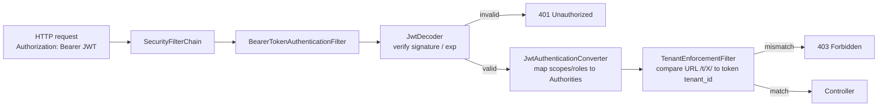

# 05 - Spring Boot 3 Resource Server integration

## Goal

Validate Keycloak JWT with Spring Boot 3 + Spring Security, and implement:

- Read the claim `tenant_id`
- Map roles / scopes into Spring Authorities
- Enforce URL path `/t/{tenant}` must match token `tenant_id`

## Demo project

This repo includes a demo API:

- [spring-boot-demo/](../spring-boot-demo/)

It contains:

- `SecurityFilterChain` with `oauth2ResourceServer().jwt()`
- `JwtAuthenticationConverter` for roles/scopes mapping
- A filter that extracts `{tenant}` from URL and validates it

## Keycloak prerequisites

- Realm: `demo`
- Client: `api`
- User: `alice`
- Token claim: `tenant_id`

## How Spring Security handles a request

Each layer can produce a 401 or 403. See [troubleshooting.md](./troubleshooting.md) §1 and §2 for matching decision trees.

## How to run

1. Start Keycloak (Chapter [02](02-quickstart-docker.md))
2. Set `alice` attribute `tenantId=acme` (Chapter [04](04-token-claims-tenant.md))
3. In `spring-boot-demo/`:

- `mvn spring-boot:run`

4. Call APIs after getting a token:

- `GET http://localhost:8081/t/acme/me`
- `GET http://localhost:8081/t/acme/reports`

Next chapter covers scopes/roles and the hybrid fine-grained authorization approach.

## Next

Continue to [06 - Fine-grained authorization (hybrid: Keycloak + API)](06-fine-grained-hybrid-authorization.md).
