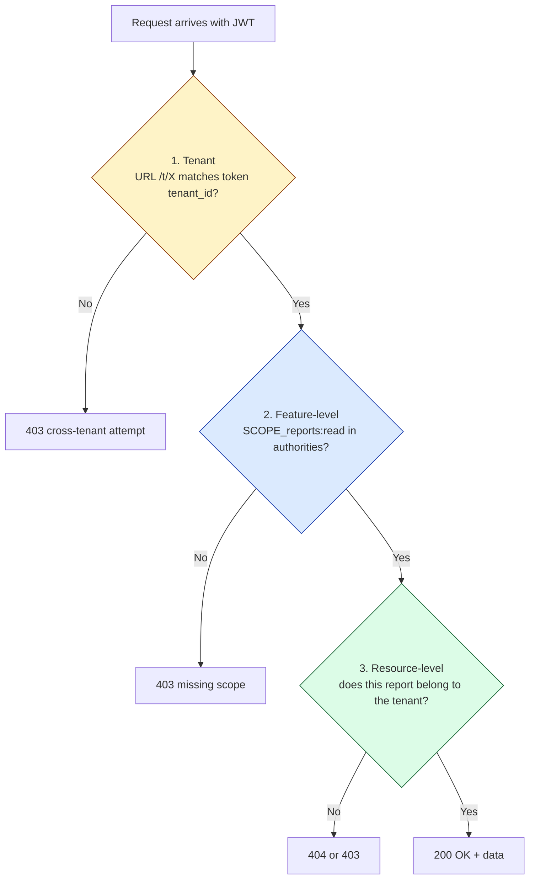

# 06 - Fine-grained authorization (hybrid: Keycloak + API)

## Goal

Secure both feature-level and resource-level access.

- Feature-level authorization: scope/roles (managed in Keycloak)
- Resource-level authorization: enforced in the API (tenant + ownership/ACL)

## Why hybrid

While Keycloak can model policies, modeling every data row as a Keycloak Resource often causes:

- high operational cost
- tight coupling to your data model

A common approach:

1) Keycloak decides if you can perform an action type
2) API decides if you can perform it on this specific record

## Three layers of authorization (in order)

| Layer | Where checked | Why |
| --- | --- | --- |
| 1. Tenant | Spring Boot filter | URL must equal token claim — prevents "swap URL with a valid token" attacks |
| 2. Feature | Spring Security `@PreAuthorize` / `hasAuthority` | Scopes/roles managed in Keycloak, consistent globally |
| 3. Resource | API code / DB query | "This record belongs to this tenant" is business semantics; Keycloak doesn't know |

> **Order matters**: tenant first (non-negotiable), then scope, then data. Cheaper checks first.

## Recommended rules

1. Tenant isolation:
   - URL `/t/{tenant}` must match token claim `tenant_id`
2. Feature-level authorization:
   - e.g. `reports:read`, `reports:write`
3. Resource-level check:
   - ensure the record belongs to the tenant

## Optional: Keycloak Authorization Services for tenant + scope

You can keep tenant + scope policies in Keycloak (scopes appear in the `scope` claim), but keep record-level checks in the API.

### Minimal approach: use Client scopes as scope strings

1. Client scopes → Create client scope
   - Name: `reports:read`
   - Type: Default
2. Create another:
   - Name: `reports:write`
   - Type: Default
3. Clients → `api` → Client scopes
   - Add `reports:read` and `reports:write` into Default client scopes

Then your access token `scope` claim should include those values (decode the token as shown in Chapter 07).

## Next

In the demo API we will:

- use `hasAuthority("SCOPE_reports:read")` for reads
- use `hasAuthority("SCOPE_reports:write")` for writes
- enforce tenant and data consistency in code

Continue to [07 - Debugging, checks, and tools](07-debugging-and-tools.md).
