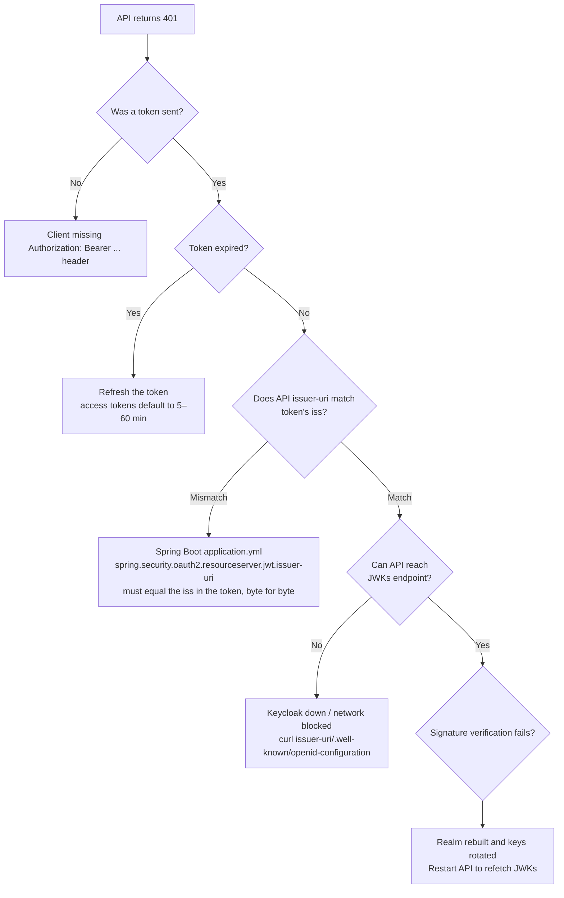
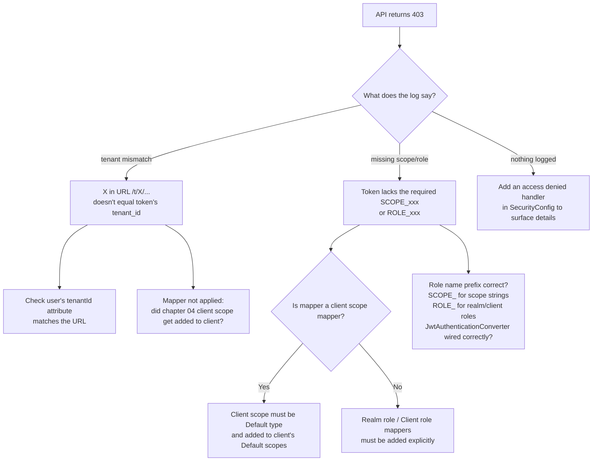
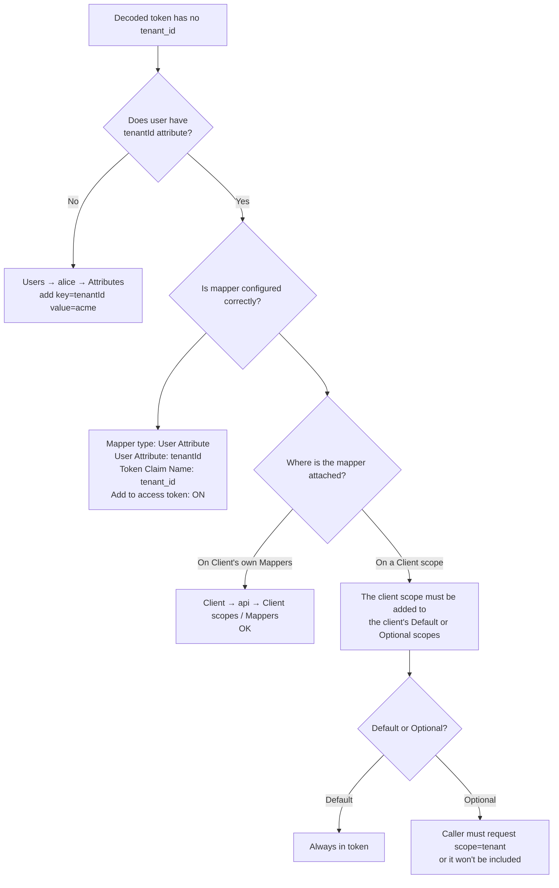
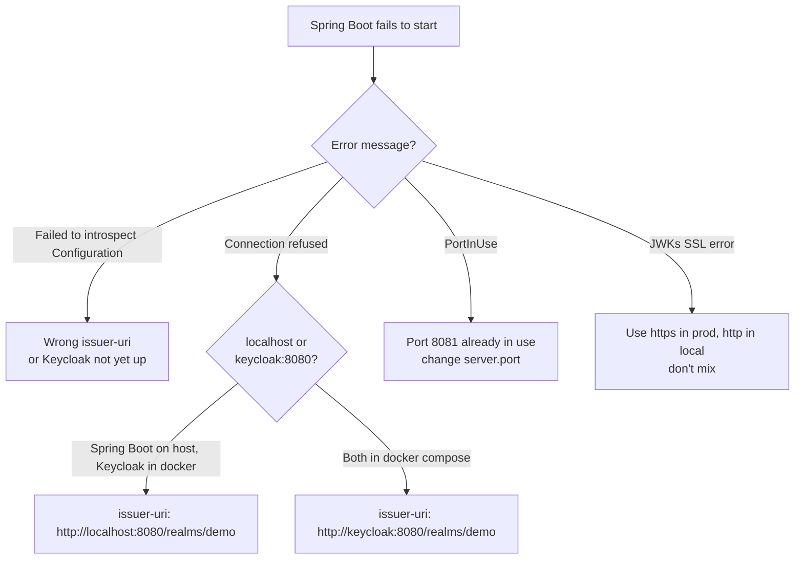
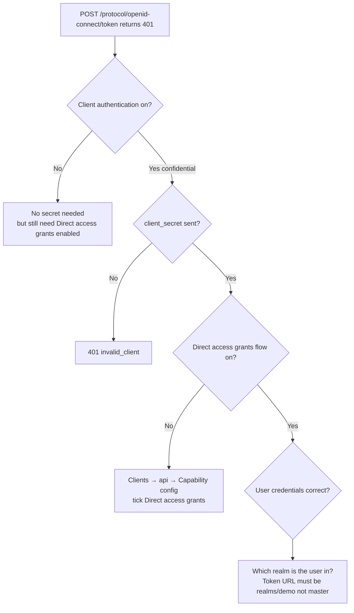

# Troubleshooting: decision trees for Keycloak

Auth errors are notoriously vague ("401" / "Forbidden"). These trees help you locate the cause fast.

> First move: **always decode the token**. Looking at it solves 50% of issues. `06-debugging-and-tools` has a one-liner Python decoder. Or use `jq` / jwt.io (**never paste production tokens**).

## 1. API returns 401 Unauthorized

### Quick lookup

| Message | Usual cause |
| --- | --- |
| `Bearer error="invalid_token", "Signed JWT rejected: Invalid signature"` | Issuer fine but JWKs cache stale / realm rebuilt. Restart API |
| `Jwt expired at ...` | Token expired, fetch a new one |
| `Couldn't retrieve remote JWK set: ...` | Keycloak down, wrong issuer-uri, or container hostnames not aligned |

## 2. API returns 403 Forbidden

403 means token is valid but **not allowed**. Usually tenant / scope / role insufficient.

## 3. Token is missing the `tenant_id` claim

## 4. Spring Boot won't start / can't connect

> **Issuer must match exactly** — including trailing slash, http vs https, hostname casing.

## 5. 401 at the token endpoint (grant fails)

## 6. CORS / browser login fails

| Symptom | Cause |
| --- | --- |
| Browser console `CORS error` | Client's `Web origins` not set. Use `+` (mirror redirect URIs) or list your frontend origin |
| `Invalid redirect URI` after redirect | `Valid redirect URIs` doesn't include the actual URL. Add the full URL (with path) |
| No access token after login | Used implicit flow (deprecated). Switch to Authorization Code + PKCE |

## 7. Realm / keys rebuilt and everything broke

`docker compose down -v` wipes the Postgres volume — realm and signing keys gone. After rebuilding:

- All previously-issued tokens become invalid-signature
- API may have cached old JWKs
- Restart the API and re-issue tokens

## 8. Still stuck

1. Decode the token from `06-debugging-and-tools` and **inspect every field**: `iss`, `aud`, `exp`, `scope`, `tenant_id`
2. Enable Keycloak admin event log (Realm settings → Events → Admin events)
3. In Spring Boot, set `logging.level.org.springframework.security=DEBUG` to see filter chain decisions
4. Use `curl -v` to watch the token endpoint flow byte by byte
