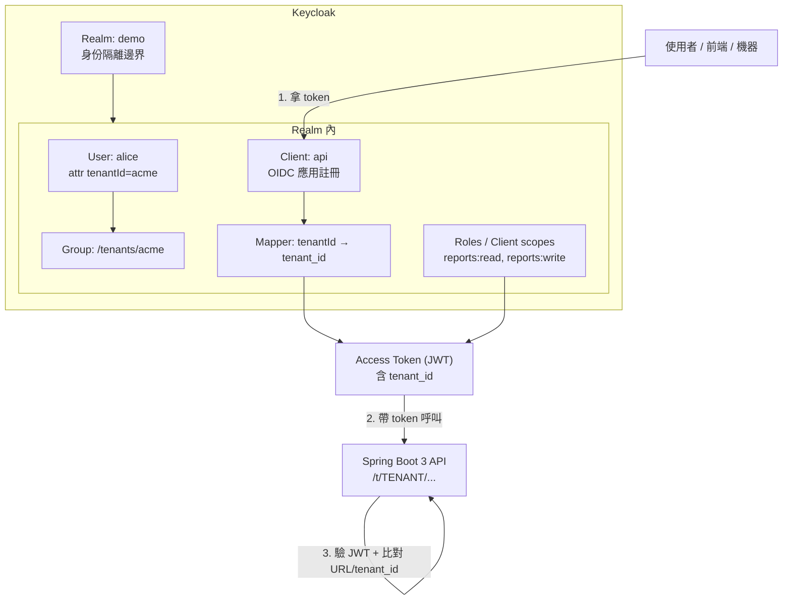
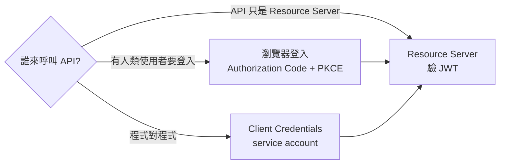

# 00 — 總覽：從哪裡開始

第一次接觸 Keycloak，先用一張圖看完核心物件、決定你要走哪條路、認識常見詞彙。

## 1. 一張圖看 Keycloak

**核心 6 個名詞**：Realm（隔離域）→ User（使用者，可帶 attribute）→ Client（應用註冊）→ Mapper（把 attribute / role 放進 token）→ Token（JWT）→ Resource Server（API 端驗 token）。

## 2. 三條主要使用路徑

| 路徑 | 你會做什麼 |
| --- | --- |
| **Resource Server**（本教學主軸） | 用 Spring Boot 3 驗 JWT、解 claim、比對 tenant |
| **瀏覽器登入** | 前端走 Authorization Code + PKCE，拿到 access token 再呼叫 API |
| **M2M** | 服務間用 client credentials 拿 token |

## 3. 學習路徑

```mermaid
flowchart LR
  s00[00 Overview] --> s01[01 Core concepts]
  s01 --> s02[02 Docker quickstart]
  s02 --> s03[03 Multi-tenancy URL path]
  s03 --> s04[04 Token claim mapper]
  s04 --> s05[05 Spring Boot 3 integration]
  s05 --> s06[06 Fine-grained authz]
  s06 --> s07[07 Debugging & tools]
  s07 --> s08[08 Production notes]
```

最少做完 **01 → 04** 就能對「Keycloak 的 token claim」有手感；做完 **05** 就能跑得起來；**06–08** 是把它推到能實際用。

## 4. 詞彙表

| 詞 | 意義 | 容易混淆 |
| --- | --- | --- |
| **Realm** | 一個獨立的身份/授權域；不同 realm 完全不共用 | 跟 OIDC `iss` 對應；`http://host/realms/<name>` |
| **Client** | 對 Keycloak 註冊的「應用」；不是 user，也不是程式實例 | confidential client（有 secret） vs public client（無） |
| **User** | 真人或服務帳號；可帶 attributes、加入 group | 跟 OIDC `sub` 對應 |
| **Role vs Scope** | role 偏「你是誰」，scope 偏「你能做什麼」 | role 不會自動進 token，要靠 mapper |
| **Realm role vs Client role** | realm role 在整個 realm 通用；client role 綁特定 client | 大多數情況用 realm role |
| **Client scope** | 一組 mapper / scope 的集合，可分配給多個 client | 是 Keycloak 的**設定載體**，不是 OIDC 的 `scope` 字串 |
| **Mapper** | 把 user/group/role 屬性塞進 token claim 的規則 | 必須在 client 或 client scope 上 |
| **Direct Access Grants** | password grant，user 把帳號密碼丟給 client | **正式環境不要開**；只給學習用 |
| **JWKs** | API 端拿來驗 JWT 簽章的公鑰 | Spring Boot 會自動從 issuer 找；issuer 配錯會 401 |

## 5. 前置知識

讀這份**不需要**：Keycloak 經驗。

讀這份**最好已經懂**：

- HTTP / Bearer token 概念
- 一點點 OIDC / OAuth 2.0（access token / id token / refresh token 是什麼）
- Docker 基本（會跑 docker compose up）
- Java / Spring 基礎（看得懂 Spring Security 的 filter chain）

## 6. 動手前要做的事

1. 裝好 **Docker Desktop** 與 **Java 17+** + **Maven**
2. 確認 `8080`（Keycloak）、`8081`（Spring Boot demo）、`5432`（Postgres）沒被佔用
3. 從 [01-core-concepts.md](./01-core-concepts.md) 開始

## 7. 卡住時去哪

→ [troubleshooting.md](./troubleshooting.md)：401、403、token claim 沒出現、tenant 比對失敗、Spring Boot 起不來等決策樹。
