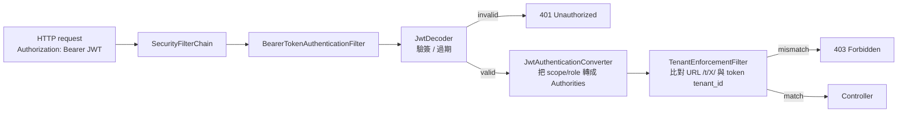

# 05 - Spring Boot 3 Resource Server 整合

## 目標

用 Spring Boot 3 + Spring Security 驗證 Keycloak JWT，並完成：

- 解析 token claim `tenant_id`
- 解析 roles / scope → Spring Authorities
- 強制 URL path `/t/{tenant}` 與 `tenant_id` 一致

## 本章使用的範例專案

本 repo 已包含範例 API：

- [spring-boot-demo/](../spring-boot-demo/)

你會在其中看到：

- `SecurityFilterChain` + `oauth2ResourceServer().jwt()`
- `JwtAuthenticationConverter`（roles/scope 映射）
- 一個 filter 解析 URL tenant 並做比對

## 你需要先完成的 Keycloak 設定

- Realm：`demo`
- Client：`api`
- user：`alice`
- token claim：`tenant_id`

## 請求進來時 Spring Security 怎麼跑

每一層都有可能讓你拿到 401 或 403。看 [troubleshooting.md](./troubleshooting.md) 第 1、2 節對應決策樹。

## 你將如何跑起來

1. 先啟動 Keycloak（見 [02 章](02-quickstart-docker.md)）
2. 設好 `alice` 的 `tenantId=acme`（見 [04 章](04-token-claims-tenant.md)）
3. 在 `spring-boot-demo/`：

- `mvn spring-boot:run`

4. 取得 token 後呼叫 API：

- `GET http://localhost:8081/t/acme/me`
- `GET http://localhost:8081/t/acme/reports`

> 下一章會補上 scope/role 與細粒度授權混合的完整練習流程。

## 下一步

繼續到 [06 - 細粒度授權（混合：Keycloak + API）](06-fine-grained-hybrid-authorization.md)。
