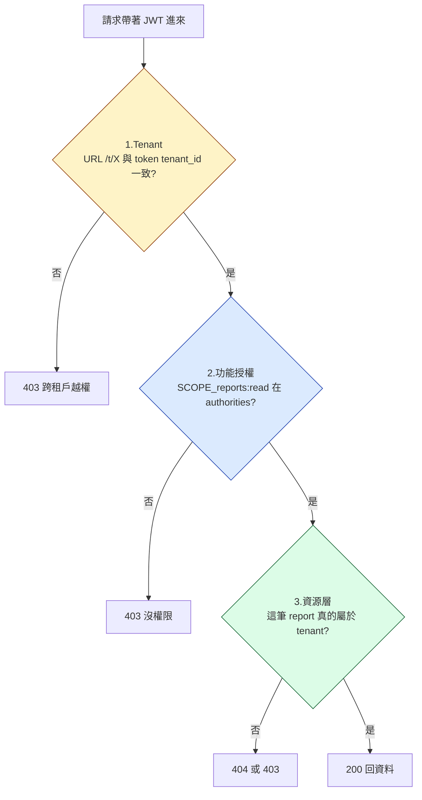

# 06 - 細粒度授權（混合：Keycloak + API）

## 目標

做到「功能面」與「資源層」都安全。

- 功能面（feature-level）：scope/role（Keycloak 端管理）
- 資源層（data-row / resource-level）：由 API 端檢查（tenant + 擁有者/ACL）

## 為什麼要混合

Keycloak 可以做 policy，但把所有資料列都變成 Keycloak Resource 通常會：

- 管理成本高
- 與你的資料模型耦合過深

所以常見做法是：

1) Keycloak 管「你能不能做某類操作」
2) API 管「你能不能對這筆資料做操作」

## 三層授權（依序檢查）

| 層級 | 由誰檢查 | 為什麼 |
| --- | --- | --- |
| 1. Tenant | Spring Boot filter | URL 跟 token claim 必須一致，避免「拿合法 token 改 URL」越權 |
| 2. 功能授權 | Spring Security `@PreAuthorize` / `hasAuthority` | scope/role 在 Keycloak 管，全域一致 |
| 3. 資源層 | API 程式碼 / DB query | 「這筆資料屬於這個 tenant」是業務語意，Keycloak 不知道 |

> 三層**順序很重要**：先擋租戶（最不可妥協），再 scope，最後資料。檢查越早成本越低。

## 建議的實作規則

1. 先做租戶隔離（tenant）：
   - URL `/t/{tenant}` 與 `tenant_id` 必須一致
2. 再做功能面授權（scope/role）：
   - 例如 `reports:read`、`reports:write`
3. 最後做資源層檢查：
   - 例如這筆 report 是否屬於該 tenant

## Keycloak 端（可選）：用 Authorization Services 管 tenant + scope

如果你想把 tenant + scope 的 policy 放在 Keycloak：

- 建立 scopes：`reports:read`、`reports:write`
- 讓它們出現在 access token 的 `scope` claim（讓 API 可以用 `SCOPE_reports:read` / `SCOPE_reports:write` 判斷）

### 最小可行做法：用 Client scope 當成 scope 字串

1. Client scopes → Create client scope
   - Name：`reports:read`
   - Type：Default
2. 再建立一個：
   - Name：`reports:write`
   - Type：Default
3. Clients → `api` → Client scopes
   - 把 `reports:read` 與 `reports:write` 加到 Default client scopes

接著你用 token endpoint 拿到的 access token，payload 內的 `scope` 通常會包含這兩個值（用 06 章的方式解 token 來確認）。

但「reportId 層級」建議仍留在 API 端。

## 下一步

完成本章後，我們會在範例 API：

- 用 `hasAuthority("SCOPE_reports:read")` 控制讀取
- 用 `hasAuthority("SCOPE_reports:write")` 控制寫入
- 在程式碼中強制 tenant 與資料一致

繼續到 [07 - 除錯、檢核與工具](07-debugging-and-tools.md)。
