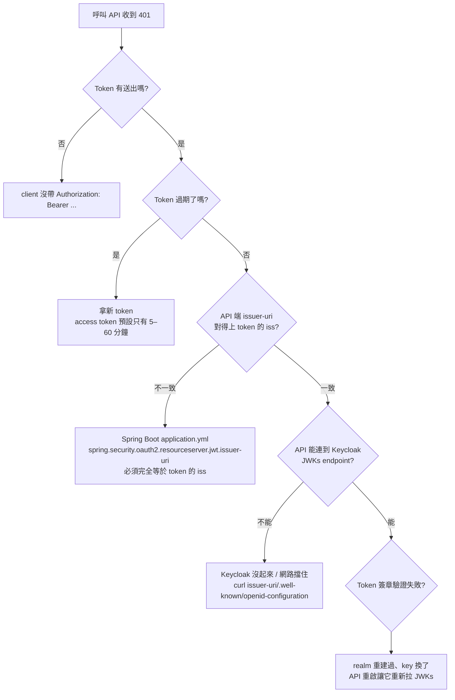
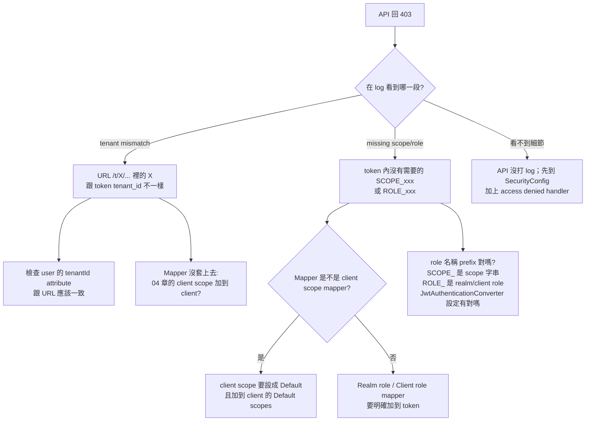
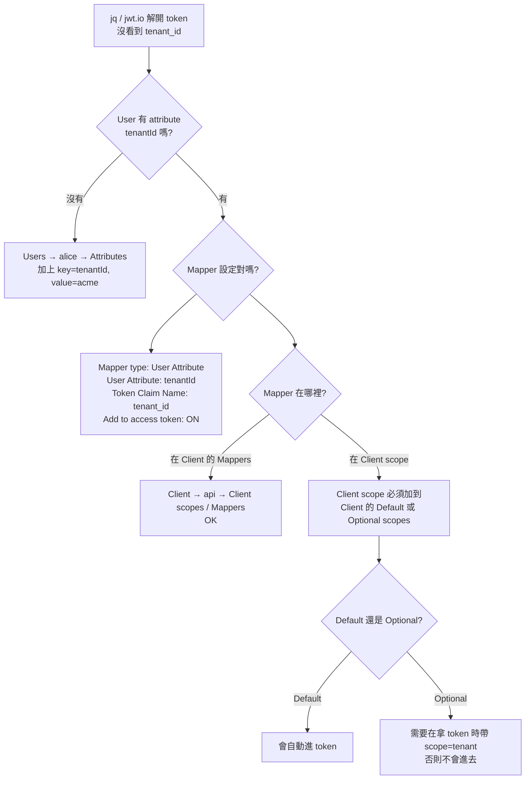
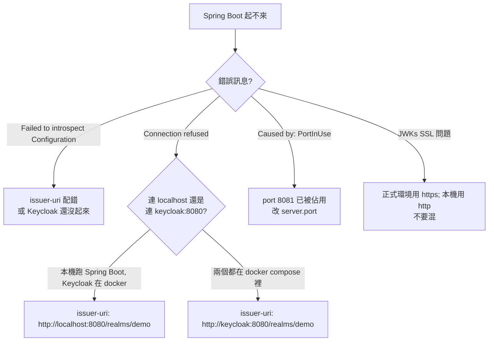
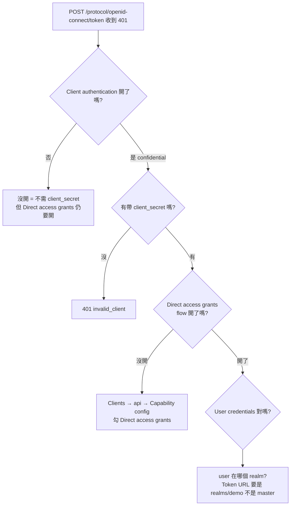

# Troubleshooting：Keycloak 常見問題決策樹

身份驗證錯誤的訊息常常很模糊（"401" / "Forbidden"）。這篇用決策樹幫你快速定位。

> 起手式：**永遠先解 token**。看 token 內容你 50% 的問題就明朗了。`06-debugging-and-tools` 有解 JWT 的 Python 一行命令；或用 `jq` / 線上 jwt.io（**不要丟正式 token**）。

## 1. API 回 401 Unauthorized

### 速查

| 訊息 | 多半的原因 |
| --- | --- |
| `Bearer error="invalid_token", error_description="An error occurred while attempting to decode the Jwt: Signed JWT rejected: Invalid signature"` | issuer 對但 JWKs 過期 / realm 重建。重啟 API |
| `An error occurred while attempting to decode the Jwt: Jwt expired at ...` | Token 過期，重拿 |
| `Couldn't retrieve remote JWK set: ...` | Keycloak 沒起來、issuer-uri 配錯、容器網路名稱沒對齊 |

## 2. API 回 403 Forbidden

403 表示驗過了，但**不允許**。多半是 tenant / scope / role 不夠。

## 3. Token 裡沒有 `tenant_id` claim

## 4. Spring Boot 啟動失敗 / 一直連不上

> **Issuer 兩端必須一字不差**——包含結尾有沒有 `/`、是 `http` 或 `https`、host 名稱大小寫。

## 5. 拿 token 時 401（grant_type 階段就失敗）

## 6. CORS / 前端登入失敗

| 症狀 | 原因 |
| --- | --- |
| 瀏覽器 console `CORS error` | Client 的 `Web origins` 沒設好。設 `+`（自動帶 redirect URIs） 或加上你的前端 origin |
| Redirect 後 `Invalid redirect URI` | `Valid redirect URIs` 不含實際的 redirect URL；要加上完整 URL（含 path） |
| 登入後 access token 沒拿到 | 用了 implicit flow（已淘汰）。改用 Authorization Code + PKCE |

## 7. Realm / Key 重建後一切都壞掉

當你 `docker compose down -v` 清了 Postgres volume，realm 連同 signing key 都消失。重建後：

- 之前發出的 token 全部變成 invalid signature
- API 第一次驗 token 時拉 JWKs 會拿到新公鑰，**但已快取舊的就會失敗**
- 重啟 API、重新登入拿新 token

## 8. 仍找不到原因

1. 用 `06-debugging-and-tools` 的 Python 解 token，**逐欄位檢查**：`iss`、`aud`、`exp`、`scope`、`tenant_id`
2. 在 Keycloak 開 admin event log（Realm settings → Events → Admin events）
3. 在 Spring Boot 把 `logging.level.org.springframework.security=DEBUG` 開起來看 filter chain 跑到哪
4. 用 `curl -v` 觀察整個 token endpoint 流程
